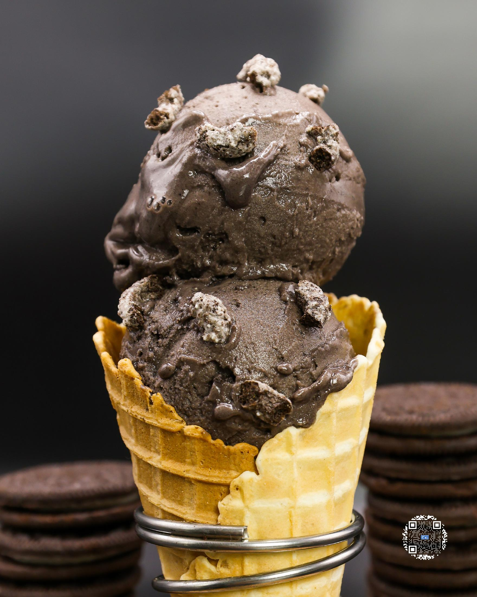
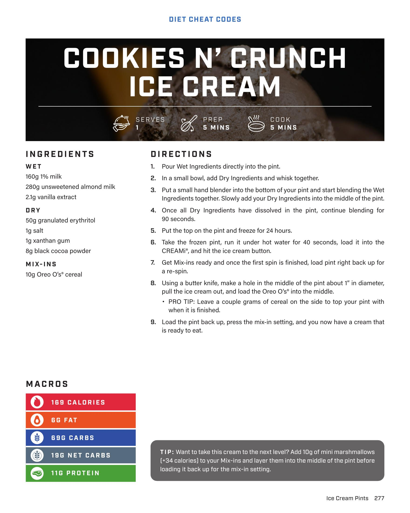

# COOKIES N' CRUNCH ICE CREAM

**Serves:** 1 | **Prep:** 5 MINS | **Cook:** 5 MINS

## Macros

| Calories | Fat | Carbs | Net Carbs | Protein |
|----------|-----|-------|-----------|---------|
| 169 | 6 | 6 | 1 | 11 |

## Ingredients

### WET

- 160g 1% milk
- 280g unsweetened almond milk
- 2.1g vanilla extract

### DRY

- 50g granulated erythritol
- 1g salt
- 1g xanthan gum
- 8g black cocoa powder

### MIX-INS

- 10g Oreo O's® cereal

## Directions

1. Pour Wet Ingredients directly into the pint.
2. In a small bowl, add Dry Ingredients and whisk together.
3. Put a small hand blender into the bottom of the pint and start blending the Wet Ingredients together. Slowly add your Dry Ingredients into the middle of the pint.
4. Once all Dry Ingredients have dissolved in the pint, continue blending for 90 seconds.
5. Put the top on the pint and freeze for 24 hours.
6. Take the frozen pint, run it under hot water for 40 seconds, load it into the CREAMi®, and hit the ice cream button.
7. Get Mix-ins ready and once the first spin is finished, load pint right back up for a re-spin.
8. Using a butter knife, make a hole in the middle of the pint about 1" in diameter, pull the ice cream out, and load the Oreo O's® into the middle.
9. Load the pint back up, press the mix-in setting, and you now have a cream that is ready to eat.

## Tips

Want to take this cream to the next level? Add 10g of mini marshmallows (+34 calories) to your Mix-ins and layer them into the middle of the pint before loading it back up for the mix-in setting. Leave a couple grams of cereal on the side to top your pint with when it is finished.

## Additional Recipe Pages

## Source Pages

277, 278
