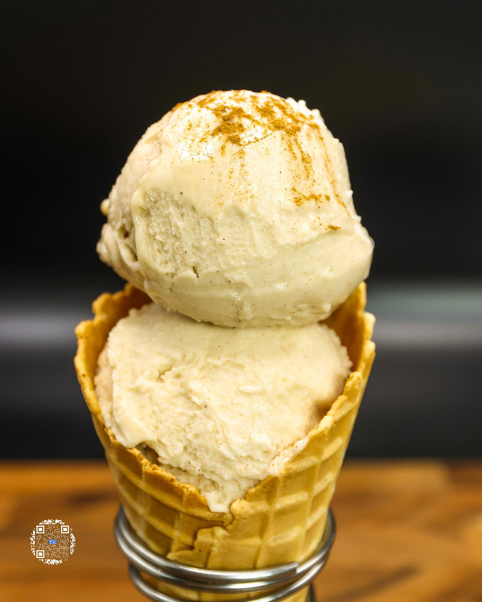
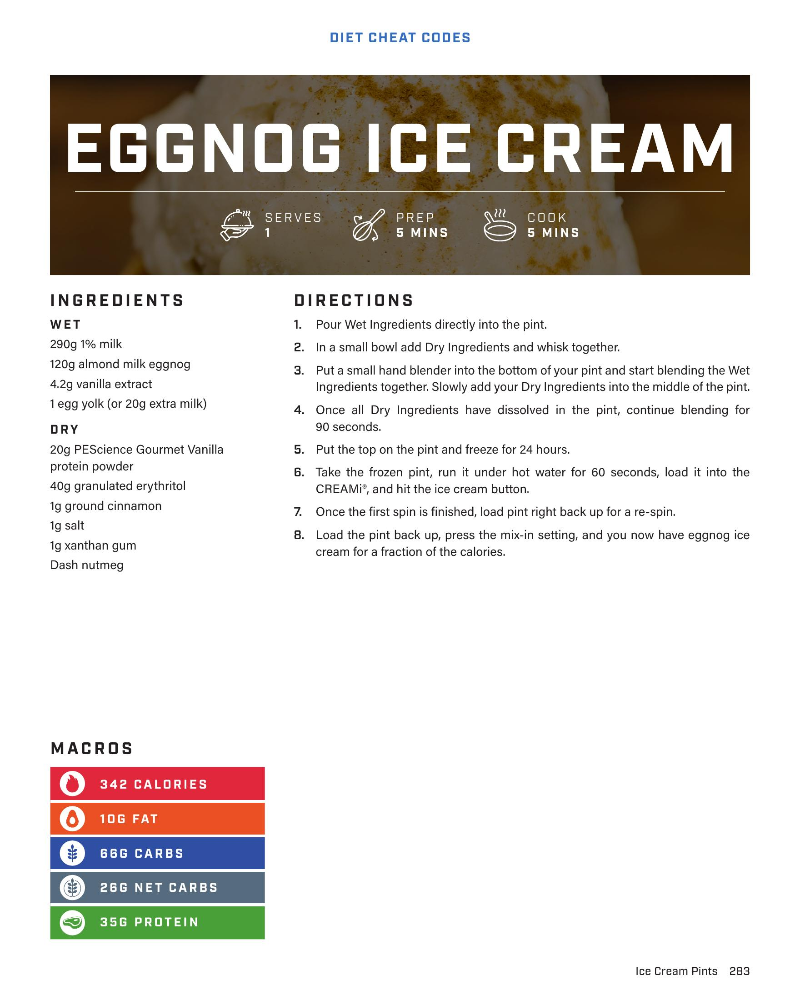

# EGGNOG ICE CREAM

**Serves:** 1 | **Prep:** 5 MINS | **Cook:** 5 MINS

## Macros

| Calories | Fat | Carbs | Net Carbs | Protein |
|----------|-----|-------|-----------|---------|
| 342 | 10 | 66 | 26 | 35 |

## Ingredients

### WET

- 290g 1% milk
- 120g almond milk eggnog
- 4.2g vanilla extract
- 1 egg yolk (or 20g extra milk)

### DRY

- 20g PEScience Gourmet Vanilla protein powder
- 40g granulated erythritol
- 1g ground cinnamon
- 1g salt
- 1g xanthan gum
- Dash nutmeg

## Directions

1. Pour Wet Ingredients directly into the pint.
2. In a small bowl add Dry Ingredients and whisk together.
3. Put a small hand blender into the bottom of your pint and start blending the Wet Ingredients together. Slowly add your Dry Ingredients into the middle of the pint.
4. Once all Dry Ingredients have dissolved in the pint, continue blending for 90 seconds.
5. Put the top on the pint and freeze for 24 hours.
6. Take the frozen pint, run it under hot water for 60 seconds, load it into the CREAMI®, and hit the ice cream button.
7. Once the first spin is finished, load pint right back up for a re-spin.
8. Load the pint back up, press the mix-in setting, and you now have eggnog ice cream for a fraction of the calories.

## Additional Recipe Pages

## Source Pages

283, 284
