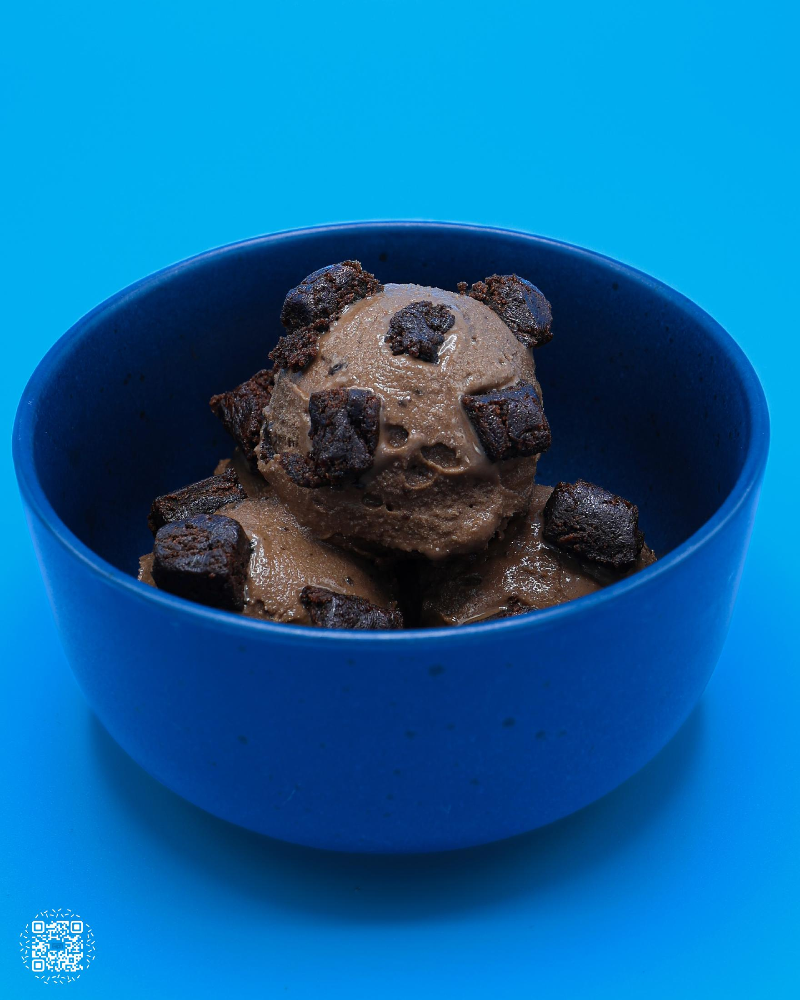
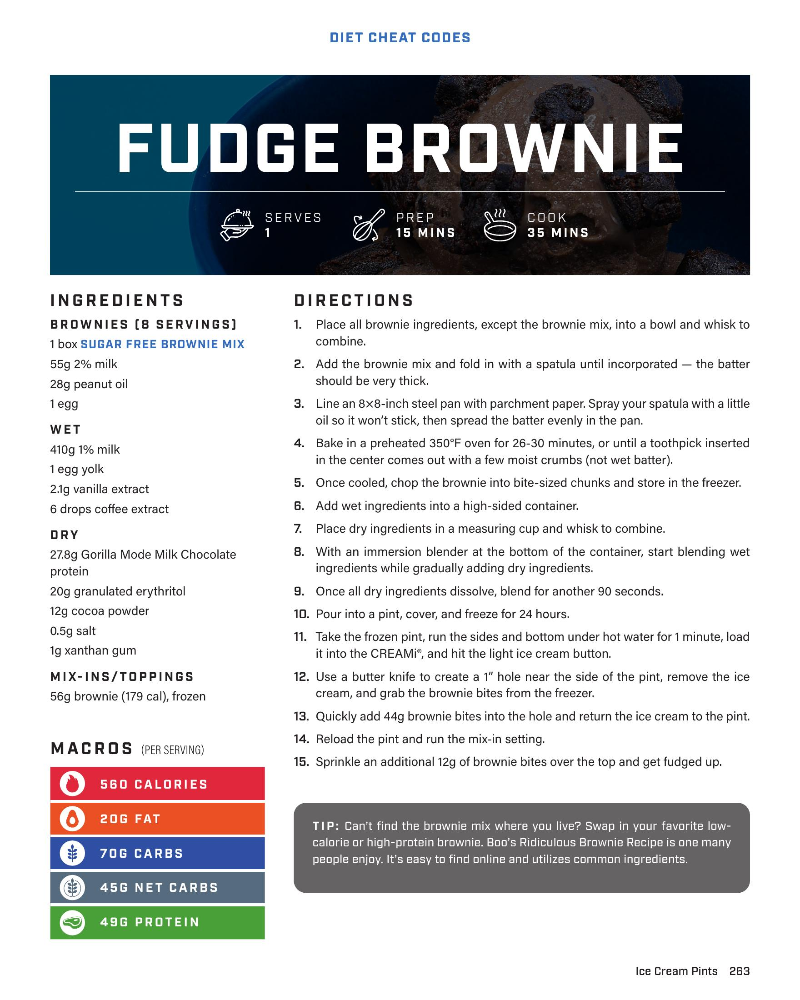

# FUDGE BROWNIE

**Serves:** 1 | **Prep:** 15 MINS | **Cook:** 35 MINS

## Macros

| Calories | Fat | Carbs | Net Carbs | Protein |
|----------|-----|-------|-----------|---------|
| 560 | 20 | 70 | 45 | 49 |

## Ingredients

### BROWNIES (8 SERVINGS)

- 1 box SUGAR FREE BROWNIE MIX
- 55g 2% milk
- 28g peanut oil
- 1 egg

### WET

- 410g 1% milk
- 1 egg yolk
- 2.1g vanilla extract
- 6 drops coffee extract

### DRY

- 27.8g Gorilla Mode Milk Chocolate protein
- 20g granulated erythritol
- 12g cocoa powder
- 0.5g salt
- 1g xanthan gum

### MIX-INS/TOPPINGS

- 56g brownie (179 cal), frozen

## Directions

1. Place all brownie ingredients, except the brownie mix, into a bowl and whisk to combine.
2. Add the brownie mix and fold in with a spatula until incorporated the batter should be very thick.
3. Line an 8x8-inch steel pan with parchment paper. Spray your spatula with a little oil so it won't stick, then spread the batter evenly in the pan.
4. Bake in a preheated 350°F oven for 26-30 minutes, or until a toothpick inserted in the center comes out with a few moist crumbs (not wet batter).
5. Once cooled, chop the brownie into bite-sized chunks and store in the freezer.
6. Add wet ingredients into a high-sided container.
7. Place dry ingredients in a measuring cup and whisk to combine.
8. With an immersion blender at the bottom of the container, start blending wet ingredients while gradually adding dry ingredients.
9. Once all dry ingredients dissolve, blend for another 90 seconds.
10. Pour into a pint, cover, and freeze for 24 hours.
11. Take the frozen pint, run the sides and bottom under hot water for 1 minute, load it into the CREAMI®, and hit the light ice cream button.
12. Use a butter knife to create a 1" hole near the side of the pint, remove the ice cream, and grab the brownie bites from the freezer.
13. Quickly add 44g brownie bites into the hole and return the ice cream to the pint.
14. Reload the pint and run the mix-in setting.
15. Sprinkle an additional 12g of brownie bites over the top and get fudged up.

## Tips

Can't find the brownie mix where you live? Swap in your favorite low-calorie or high-protein brownie. Boo's Ridiculous Brownie Recipe is one many people enjoy. It's easy to find online and utilizes common ingredients.

## Additional Recipe Pages

## Source Pages

263, 264
