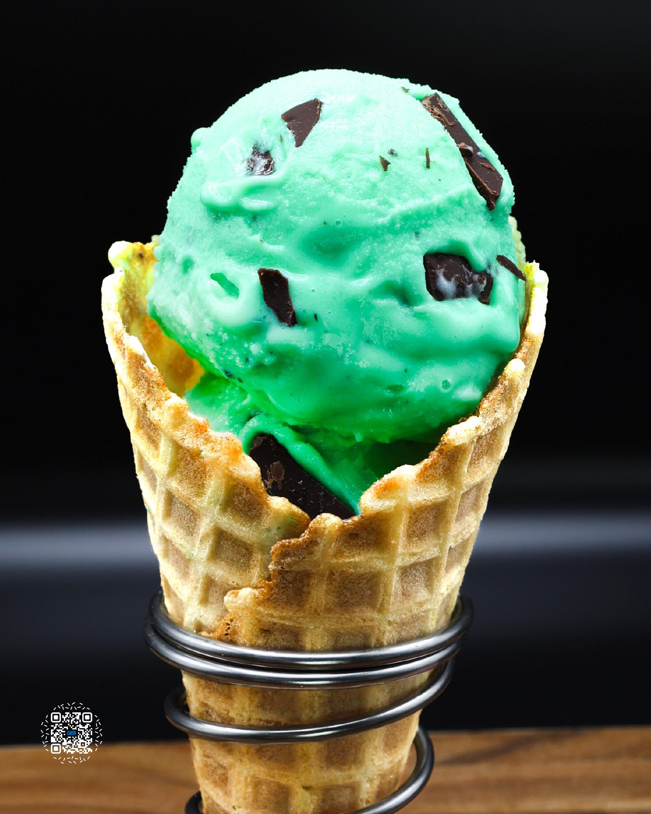

# MINT CHOCOLATE CHIP

**Serves:** 1 | **Prep:** 15 MINS | **Cook:** 15 MINS

## Macros

| Calories | Fat | Carbs | Net Carbs | Protein |
|----------|-----|-------|-----------|---------|
| 456 | 16 | 49 | 29 | 50 |

## Ingredients

### MELTING CHOCOLATE

- 113g semi-sweet chocolate bar
- 7g peanut oil

### WET

- 430g 1% milk
- 4.2g vanilla extract
- Peppermint extract (See tip below!)
- 8 drops green food coloring (not necessary)

### DRY

- 32.4 Gorilla Mode Vanilla Ice Cream protein
- 20g granulated erythritol
- .5g salt
- .5g xanthan gum

### MIX-INS

- 28g melting chocolate

## Directions

1. Melt chocolate using the double boiler method.
2. Fill a small pot with 1" of water and bring to a simmer. Place a ceramic bowl over the pot, making sure the bowl is wider than the pot. Add chocolate.
3. Once melted, add oil and mix with a whisk until combined.
4. Line a quarter sheet pan or small tray with parchment paper.
5. Add the melted chocolate to the sheet pan and spread into a thin layer. Freeze until solid.
6. Add chocolate to a cutting board and chop into bite sized pieces. Add chocolate to a plastic bag and freeze. This makes enough chocolate for 4 pints.
7. Add Wet Ingredients into a high-sided container.
8. In a measuring cup, add Dry Ingredients and whisk together.
9. Put an immersion blender in the bottom of the container and start blending the Wet Ingredients together. Slowly add your Dry Ingredients into the container.
10. Once all Dry Ingredients have dissolved, continue blending for 90 seconds.
11. Add the liquid to a pint, put the top on, and freeze for 24 hours.
12. Take the frozen pint, run it under hot water for 60 seconds, load it into the CREAMI®, and hit the sorbet button.
13. Using a butter knife, make a hole in the middle of the pint about 1" in diameter, pull the ice cream out, and load the chocolate into the center.
14. Don't pull the chocolate out of the freezer until you need to fill the center. The chocolate melts very quickly at room temperature.
15. Place the previously removed ice cream into the pint, reload the pint, and press the mix-in setting.

## Tips

Peppermint extract strength and flavor is going to vary brand to brand. The two I experimented with are Loranns Oils® and McCormick's®. They both taste great in mint ice cream, but have their differences. McCormick's® is a more laid back mint flavor while LorAnn's® is more intense. If using McCormick's®, use 12 drops. If using LorAnn's®, use 4 drops.

