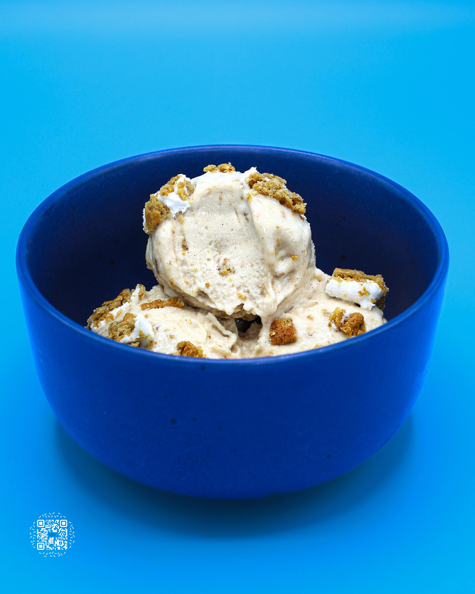
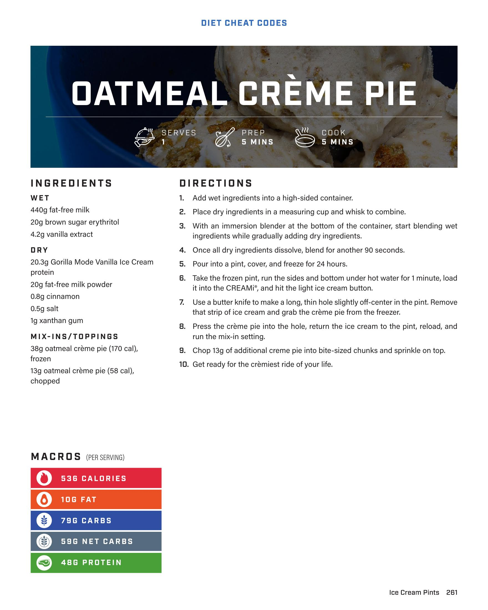

# OATMEAL CRÈME PIE

**Serves:** 1 | **Prep:** 5 MINS | **Cook:** 5 MINS

## Macros

| Calories | Fat | Carbs | Net Carbs | Protein |
|----------|-----|-------|-----------|---------|
| 536 | 10 | 79 | 59 | 48 |

## Ingredients

### WET

- 440g fat-free milk
- 20g brown sugar erythritol
- 4.2g vanilla extract

### DRY

- 20.3g Gorilla Mode Vanilla Ice Cream protein
- 20g fat-free milk powder
- 0.8g cinnamon
- 0.5g salt
- 1g xanthan gum

### MIX-INS/TOPPINGS

- 38g oatmeal crème pie (170 cal), frozen
- 13g oatmeal crème pie (58 cal), chopped

## Directions

1. Add wet ingredients into a high-sided container.
2. Place dry ingredients in a measuring cup and whisk to combine.
3. With an immersion blender at the bottom of the container, start blending wet ingredients while gradually adding dry ingredients.
4. Once all dry ingredients dissolve, blend for another 90 seconds.
5. Pour into a pint, cover, and freeze for 24 hours.
6. Take the frozen pint, run the sides and bottom under hot water for 1 minute, load it into the CREAMi®, and hit the light ice cream button.
7. Use a butter knife to make a long, thin hole slightly off-center in the pint. Remove that strip of ice cream and grab the crème pie from the freezer.
8. Press the crème pie into the hole, return the ice cream to the pint, reload, and run the mix-in setting.
9. Chop 13g of additional creme pie into bite-sized chunks and sprinkle on top.
10. Get ready for the crèmiest ride of your life.

## Additional Recipe Pages

## Source Pages

261, 262
