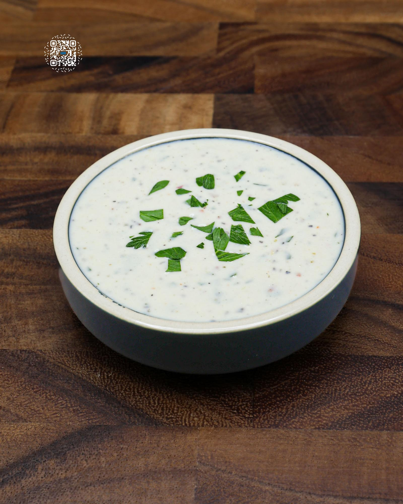

# GARLIC PARMESAN SAUCE V2

**Serves:** 13 | **Prep:** 15 MINS | **Cook:** 45 MINS

## Macros

| Calories | Fat | Carbs | Net Carbs | Protein |
|----------|-----|-------|-----------|---------|
| 44 | 3 | 2 | N/A | 3 |

## Ingredients

- 1 egg yolk
- 60g light mayonnaise
- 120g fat-free greek yogurt
- 7g garlic, minced
- 50g roasted garlic
- 42g Parmigiano-Reggiano, grated
- 14g apple cider vinegar
- 60g water
- 6g salt
- .5g dried basil
- .5g dried oregano
- .5g crushed red pepper
- .5g black pepper
- 5g avocado oil
- 1g xanthan gum
- 4g parsley, chopped

## Directions

1. ROAST 2-3 HEADS OF GARLIC.
2. Add all ingredients into a high-sided container besides avocado oil, xanthan gum, and parsley.
3. Using an immersion blender, mix to combine.
4. Add avocado oil and xanthan gum to a small bowl. Mix until the xanthan gum has completely dissolved into the oil.
5. Add oil mixture to the high-sided container and mix for 1-2 minutes.
6. Place sauce in a bottle and refrigerate.

## Notes

This sauce should stay good at least two weeks, especially if you make it with fresh greek yogurt. If you are worried about having too much sauce, I would suggest making a half batch first.

