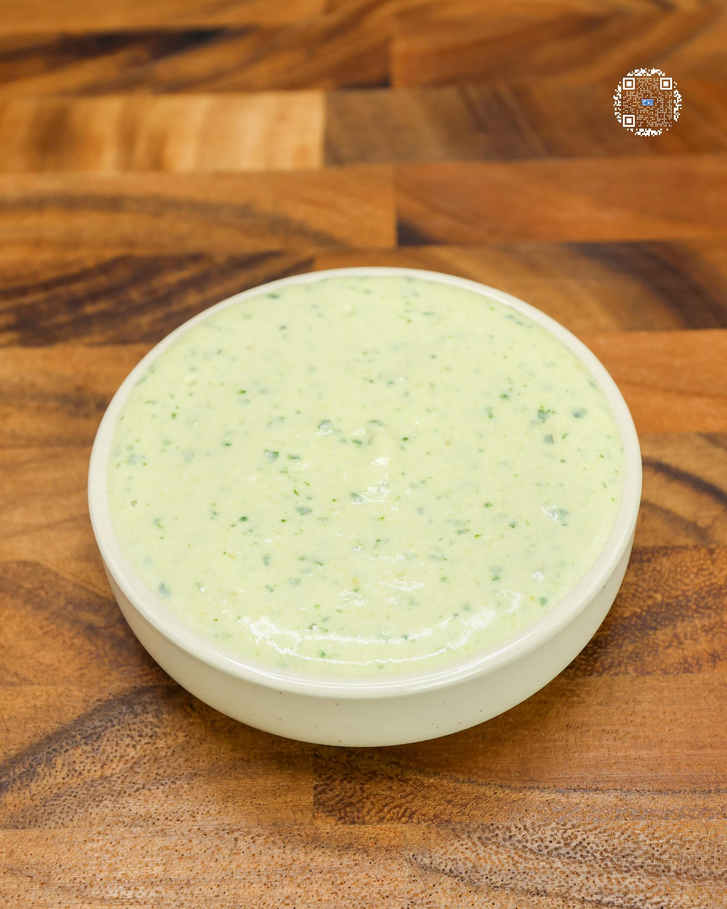

# SALSA CREMA

**Serves:** 12 | **Prep:** 5 MINS | **Cook:** N/A

## Macros

| Calories | Fat | Carbs | Net Carbs | Protein |
|----------|-----|-------|-----------|---------|
| 14 | 0 | 1 | N/A | 2 |

## Ingredients

- 220g fat-free Greek yogurt
- 4oz canned green chiles
- 5g cilantro
- 4g garlic, minced
- 10g lemon juice
- 4g salt
- 0.5g xanthan gum (optional)

## Directions

1. Put all ingredients in a medium sized bowl and mix using an immersion blender for 30-60 seconds.
2. Optional: Add xanthan gum over the top of the crema and mix in if a thicker consistency is desired.
3. Serve right away or put into a container and store in the fridge until ready to use.

## Tips

You can also make this in a food processor if you don't have an immersion blender.

