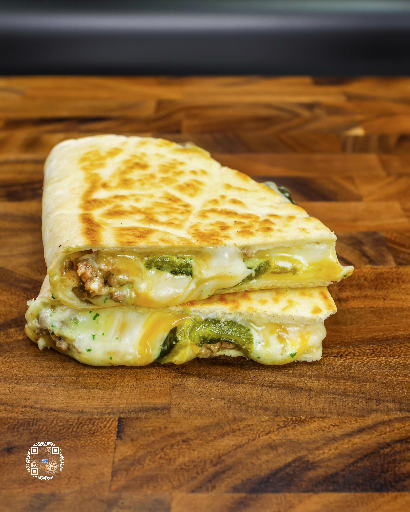

# CHEESY POBLANO QUESADILLA

**Serves:** 11 | **Prep:** 30 MINS | **Cook:** 30 MINS

## Macros

| Calories | Fat | Carbs | Net Carbs | Protein |
|----------|-----|-------|-----------|---------|
| 306 | 13 | 21 | 10 | 35 |

## Ingredients

- La Banderita® Carb Counter taco tortillas
- 4 poblano peppers
- 448g 93% lean ground beef
- 4g salt

### QUESADILLA BUILD

- 1 La Banderita® Carb Counter taco tortilla
- 35g reduced-fat colby jack cheese, shredded
- 35g fat-free mozzarella cheese, shredded
- 24g poblano peppers, roasted
- 30g 93% lean ground beef, cooked
- 25g SALSA CREMA
- 3g unsalted butter

## Directions

1. ROAST poblanos, take outer layer of skin off, and shred cheese.
2. Lightly spray a preheated cast iron pan on medium high heat, add ground beef, and flatten it into the pan using a spatula. Top the meat with salt and break the meat down into smaller chunks with a wooden spatula.
3. Constantly stir beef until cooked through, then set aside on a plate or in a separate container.
4. Put a tortilla on the counter and on the bottom half of it add half of each cheese, poblanos, salsa, beef, and the other half of each cheese and fold the top half of the tortilla over.
5. In a small container, add butter and heat up in the microwave for 20-30 seconds or until melted.
6. Brush a thin layer of butter on the top half of the quesadilla, then add the quesadilla to a preheated pan on medium heat, butter side down. Brush the remaining butter on the other side of the quesadilla.
7. After 1-2 minutes, flip the quesadilla and cook for an additional 1-2 minutes.
8. Cut it in half, plate it, and it's time to eat.

