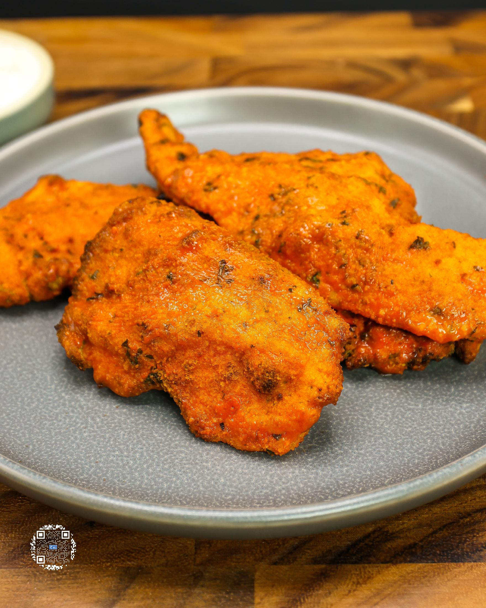
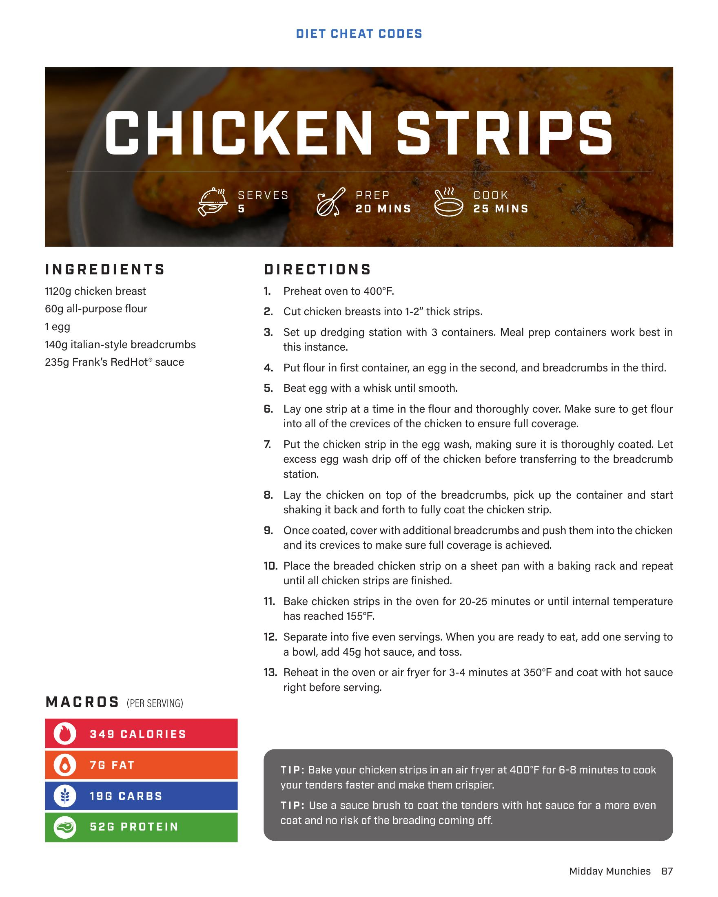

# CHICKEN STRIPS

**Serves:** 5 | **Prep:** 20 MINS | **Cook:** 25 MINS

## Macros

| Calories | Fat | Carbs | Net Carbs | Protein |
|----------|-----|-------|-----------|---------|
| 349 | 7 | 18 | undefined | 52 |

## Ingredients

- 1120g chicken breast
- 60g all-purpose flour
- 1 egg
- 140g Italian-style breadcrumbs
- 235g Frank's RedHot® sauce

## Directions

1. Preheat oven to 400°F.
2. Cut chicken breasts into 1-2" thick strips.
3. Set up dredging station with 3 containers. Meal prep containers work best in this instance.
4. Put flour in first container, an egg in the second, and breadcrumbs in the third.
5. Beat egg with a whisk until smooth.
6. Lay one strip at a time in the flour and thoroughly cover. Make sure to get flour into all of the crevices of the chicken to ensure full coverage.
7. Put the chicken strip in the egg wash, making sure it is thoroughly coated. Let excess egg wash drip off of the chicken before transferring to the breadcrumb station.
8. Lay the chicken on top of the breadcrumbs, pick up the container and start shaking it back and forth to fully coat the chicken strip.
9. Once coated, cover with additional breadcrumbs and push them into the chicken and its crevices to make sure full coverage is achieved.
10. Place the breaded chicken strip on a sheet pan with a baking rack and repeat until all chicken strips are finished.
11. Bake chicken strips in the oven for 20-25 minutes or until internal temperature has reached 165°F.
12. Separate into five even servings. When you are ready to eat, add one serving to a bowl with 45g hot sauce, and toss.
13. Reheat in the oven or air fryer for 3-4 minutes at 350°F and coat with hot sauce right before serving.

## Tips

Bake your chicken strips in an air fryer at 400°F for 6-8 minutes to cook your tenders faster and make them crispier. Use a sauce brush to coat the tenders with hot sauce for a more even coat and no risk of the breading coming off.

## Additional Recipe Pages

## Source Pages

87, 88
