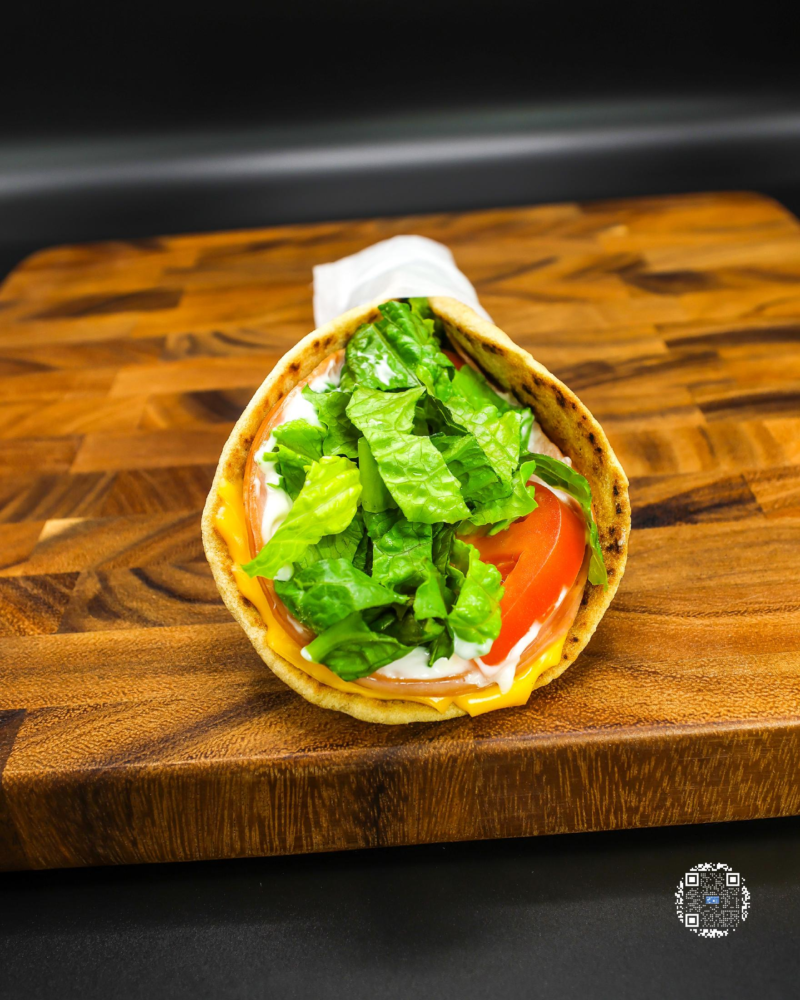
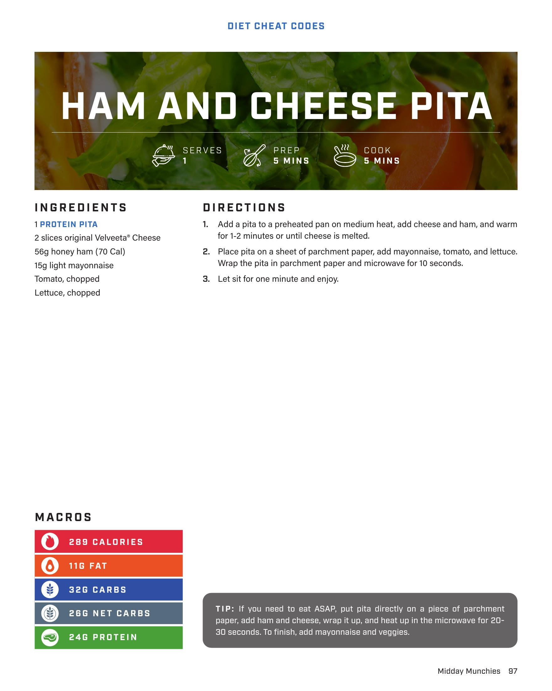

# HAM AND CHEESE PITA

**Serves:** 1 | **Prep:** 5 MINS | **Cook:** 5 MINS

## Macros

| Calories | Fat | Carbs | Net Carbs | Protein |
|----------|-----|-------|-----------|---------|
| 289 | 11 | 32 | 26 | 24 |

## Ingredients

- 1 PROTEIN PITA
- 2 slices original Velveeta® Cheese
- 56g honey ham (70 Cal)
- 15g light mayonnaise
- Tomato, chopped
- Lettuce, chopped

## Directions

1. Add a pita to a preheated pan on medium heat, add cheese and ham, and warm for 1-2 minutes or until cheese is melted.
2. Place pita on a sheet of parchment paper, add mayonnaise, tomato, and lettuce. Wrap the pita in parchment paper and microwave for 10 seconds.
3. Let sit for one minute and enjoy.

## Tips

If you need to eat ASAP, put pita directly on a piece of parchment paper, add ham and cheese, wrap it up, and heat up in the microwave for 20-30 seconds. To finish, add mayonnaise and veggies.

## Additional Recipe Pages

## Source Pages

97, 98
