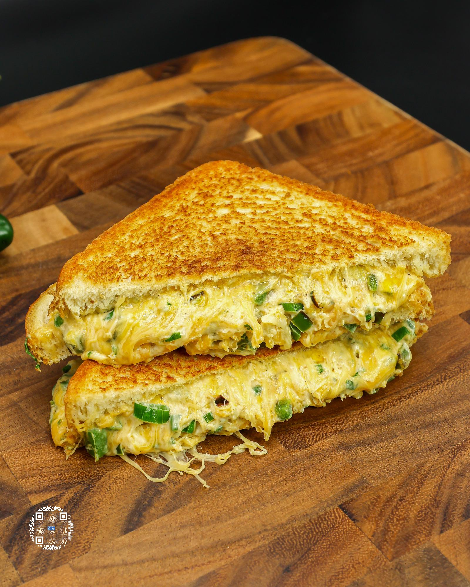

# JALAPEÑO POPPER GRILLED CHEESE

**Serves:** 1 | **Prep:** 15 MINS | **Cook:** 10 MINS

## Macros

| Calories | Fat | Carbs | Net Carbs | Protein |
|----------|-----|-------|-----------|---------|
| 412 | 17 | 35 | N/A | 33 |

## Ingredients

- 8g green onion, chopped
- 28g reduced-fat sharp cheddar cheese
- 28g pepper jack cheese
- 28g fat-free cheddar cheese
- 56g fat-free cream cheese
- Dash black pepper
- 1g salt
- 50g jalapeños, diced
- 4g garlic, minced
- 2 slices of bread (35 Cal)
- Spray oil

## Directions

1. Thinly slice green onions, shred cheese, and add to a medium-sized bowl. Add the cream cheese, black pepper, and salt.
2. Dice the jalapeños and add to a preheated pan on medium heat until blistering. If you're concerned about spice levels, remove the seeds from the jalapeño to reduce the spiciness.
3. Once the jalapeños blister, use a garlic press to mince garlic into the middle of the pan. Cook until fragrant, then add mixture to the bowl with the cheeses.
4. Mix everything in the bowl until thoroughly combined.
5. Using the same pan and keeping the heat on medium, lightly spray pan with oil and add bread to pan. Lightly spray the top of bread with oil as well.
6. Once browning starts to occur on the bottom side of the bread, flip it over and add the cheese mixture to one of the slices of bread.
7. Take the other slice of bread and place the toasted side onto the cheese mixture. Once the bottom slice of bread is toasted, flip over to toast the other side.
8. Once finished, put in microwave for 15-20 seconds or until cheese starts melting down the sides. Due to thickness of this grilled cheese, if you want a truly melty consistency this step is an absolute must.

## Tips

If bread is too soft after the microwave, put back on the pan for 1-2 minutes per side to crisp back up.

