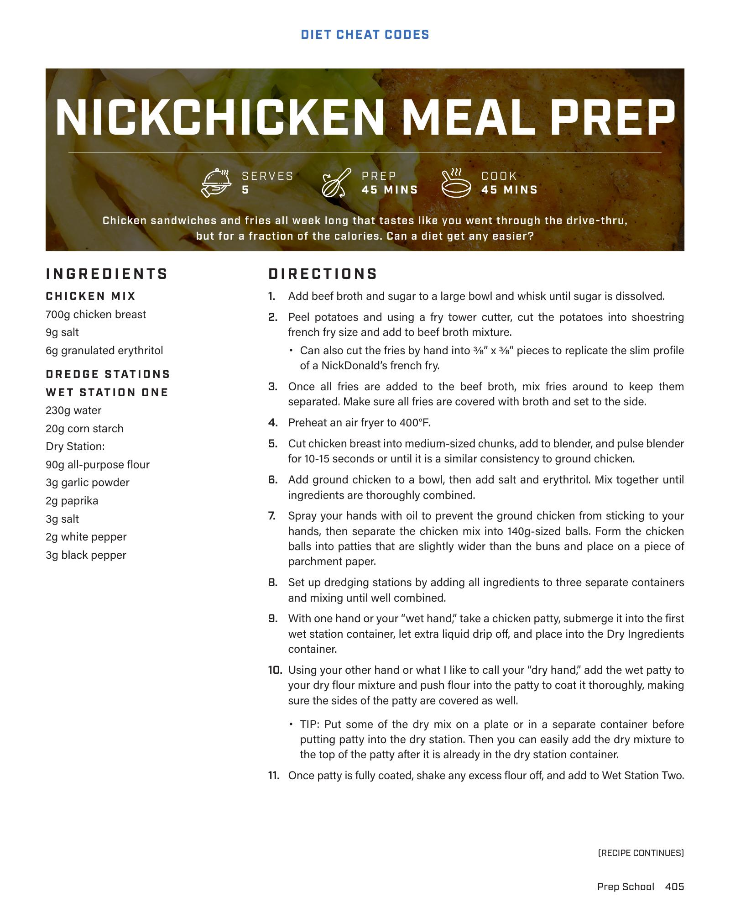

# 

**Serves:**  | **Prep:**  | **Cook:** 

## Macros

| Calories | Fat | Carbs | Net Carbs | Protein |
|----------|-----|-------|-----------|---------|
| 541 | 11 | 72 | N/A | 41 |

## Ingredients

### WET STATION TWO

- 1 egg
- 1 egg white
- 2g baking powder

### FINISHING TOUCHES

- Olive oil spray

### NICKCHICKEN BUILD

- Buns (110 Cal)
- 1 NickChicken patty
- 15g light mayonnaise
- Lettuce

### FRENCH FRIES

- 1000g russet potatoes, peeled (about 1200g before peeling)
- 1200g beef broth
- 30g sugar
- 8g oil spray
- Salt, to taste

## Directions

1. Make sure the chicken patty is completely coated in egg wash and let any excess drip off.
2. Put chicken patty back into the dry station and repeat step 10.
3. Place the finished chicken patty on wire rack and repeat.
4. Spray the bottom of the air fryer and place a patty into the air fryer basket, spraying a light coat of oil on the top of the patty.
5. Cook chicken for 6-8 minutes in the air fryer or until chicken has reached an internal temperature of 155°F, flipping halfway through.
6. Repeat until all chicken is cooked.
7. While patties are cooking, drain broth out of the fries, and add fries to a salad spinner.
8. Use salad spinner to get excess liquid off the fries and place them onto paper towels. If you don’t have a salad spinner, paper towels will work by themselves, but you will just have to use more of them.
9. Using paper towels, pat the fries dry and once the final NickChicken is finished, lightly spray the bottom of the air fryer with oil.
10. Add a layer of fries to the air fryer, lightly spray the top of the fries with oil, and repeat layering/oil combination until all fries are added.
11. Cook at 400°F for 20-25 minutes, tossing every 5-6 minutes. Every time the fries are shaken or tossed, lightly spray them with oil.
12. Take fries out, add salt to taste, and shake them to evenly disperse salt.
13. Thinly slice lettuce, add light mayo to condiment cups, lay out 5 meal prep containers, and let NickChickens and fries come to room temperature.
14. Add NickChicken, fries, lettuce, and mayo to each meal prep container and refrigerate.
15. When ready to chow down, toast the inside of a bun, place fries and NickChicken in a preheated 350°F air fryer for 3-4 minutes, plate it, and eat.

