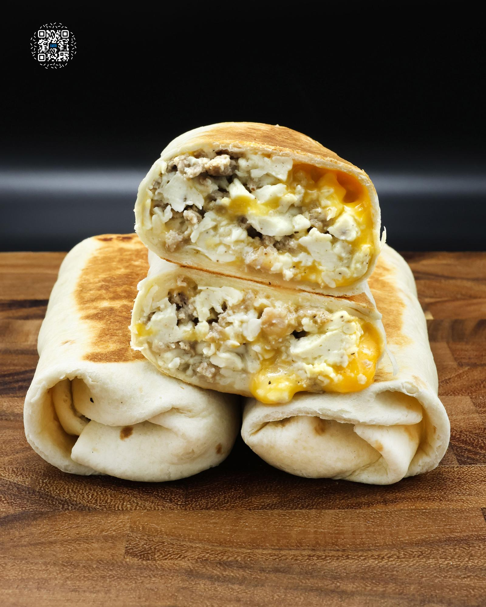

# $1 BREAKFAST BURRITO MEAL PREP

**Serves:** 5 | **Prep:** 40 MINS | **Cook:** 20 MINS

## Macros

| Calories | Fat | Carbs | Net Carbs | Protein |
|----------|-----|-------|-----------|---------|
| 461 | 20 | 37 | N/A | 32 |

## Ingredients

- Five 9" tortillas (200 cal)
- 112g 2% colby jack cheese, shredded
- 5g avocado oil
- 224g 90% lean ground pork
- 5g garlic, minced
- 4g salt
- 1g black pepper
- 1g dried sage
- .5g dried thyme
- 5g apple cider vinegar
- 10g sugar-free maple syrup
- 4g avocado oil
- 12 eggs
- 3g salt
- 1g black pepper

## Directions

1. Add ground pork, garlic, salt, pepper, sage, thyme, apple cider vinegar, and syrup to a medium bowl. Mix to combine.
2. Add oil to a preheated pan on medium heat, followed by the seasoned pork sausage, and press down on the meat until it is about a ½" thick.
3. Allow to cook for 2-3 minutes or until browned to your preference and flip.
4. Cook for an additional 30-60 seconds and chop up the sausage with a spatula or masher.
5. Add the sausage to a large bowl and place back on the stovetop on medium-low heat.
6. Add 5 whole eggs, 7 egg whites, 3g salt, and 1g black pepper to a large bowl and whisk to combine.
7. Add oil to the preheated pan, spread it around, and add the egg mixture.
8. Constantly move the eggs around the pan with a spatula until just slightly wet or about 15 seconds from being done since there will be carryover cooking.
9. Pour the scrambled eggs over the sausage, mix to combine, and allow to cool for 5-10 minutes.
10. Spread tortillas on the counter. Place cheese, eggs, and sausage on the first half of each tortilla and wrap into burritos.
11. Brush a small amount of water along the seam of the burrito. Place it seam side down into a preheated pan on medium heat. Press down on the burrito for 20-30 seconds to ensure even browning and to seal it shut.
12. After 30-45 seconds or browned to your preference, flip onto the other side, and repeat.
13. Let burritos cool and store in the fridge for up to a week or place in a vacuum sealed bag in the freezer.
14. Whether refrigerated or frozen, wrap a burrito in parchment paper. Microwave for 60-90 seconds if refrigerated or 3-4 minutes if frozen. You can also reheat it in a preheated 400° oven for 6-10 minutes if refrigerated or 16-20 minutes if frozen.

