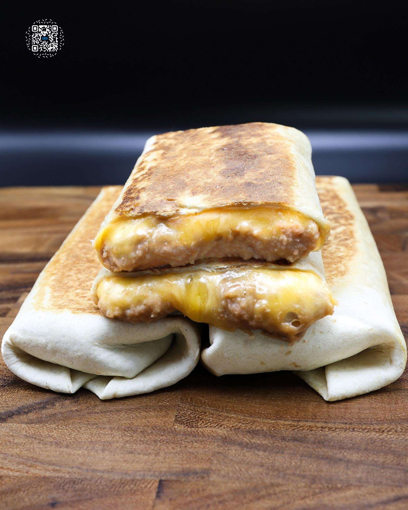

# $1 BURRITO MEAL PREP

**Serves:** 5 | **Prep:** 20 MINS | **Cook:** 3 HRS

## Macros

| Calories | Fat | Carbs | Net Carbs | Protein |
|----------|-----|-------|-----------|---------|
| 506 | 14 | 68 | N/A | 34 |

## Ingredients

### BURRITO BUILD (X5)

- 9" tortilla (200 cal)
- 160g refried beans
- 30g fat-free cheddar cheese, shredded
- 30g 2% sharp cheddar cheese, shredded
- Oil spray

## Directions

1. Make REFRIED BEANS. A pinch of smoked paprika was added to the beans for this recipe. Your final beans should be much thicccer than if you were eating them as a side dish, so they hold up better in the burrito.
2. Once beans have cooled, add beans and cheese to the middle of each tortilla. Wrap into burritos.
3. Lightly spray a preheated pan or griddle on medium heat with oil and add each burrito folded side down. Lightly press down on each burrito to ensure even browning and to help them seal.
4. After 30 seconds or browned to your preference, lightly spray the top of each burrito with oil and flip onto the other side. Again, lightly press down on each burrito and allow to brown for 30 seconds.
5. Let burritos cool and store in the fridge for up to a week or place in a vacuum sealed bag in the freezer.
6. If refrigerated, wrap burrito in parchment paper and microwave for 60-90 seconds. The same applies if frozen, but heat up 3-4 minutes or until cooked through. You can also heat a burrito up in a preheated 400° oven for 6-10 minutes if refrigerated or 16-20 minutes if frozen.

