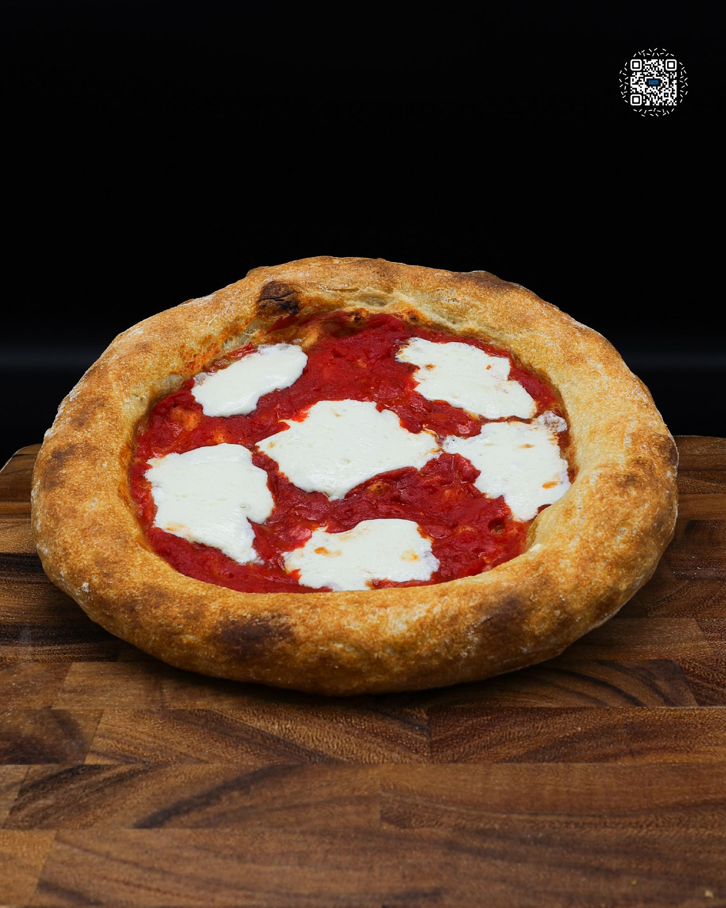

# $1 NEAPOLITAN PIZZA

**Serves:** 5 | **Prep:** 24 HR | **Cook:** 10 MINS

## Macros

| Calories | Fat | Carbs | Net Carbs | Protein |
|----------|-----|-------|-----------|---------|
| 608 | 12 | 84 | undefined | 37 |

## Ingredients

### DRY

- 475g all-purpose flour
- 100g vital wheat gluten
- 12.5g salt
- 4g instant yeast

### WET

- 425g water

### TOPPINGS

- 300g fresh mozzarella
- 350g 6 in 1 ground tomatoes

## Directions

1. In a large bowl, whisk the dry ingredients together. Add water and mix with a spoon until a shaggy dough forms.
2. Use a wet hand to press and fold the dough until fully combined and no dry parts remain. Cover and rest for 20 minutes.
3. With a wet hand, pull one side of the dough up as high as possible and fold it over itself. Rotate the bowl 90°, repeating 3-4 times. Flip the dough, form a ball, and cover for another 20 minutes.
4. Repeat step 3.
5. Divide the dough into 5 pieces, each about 200g.
6. Flatten each piece, fold the edges into the center, flip, and shape into a ball by pulling it toward yourself. Rotate 90° and repeat until smooth.
7. Place each dough ball in a vacuum-sealed bag and refrigerate for 24 hours.
8. After refrigeration, re-seal each bag to remove any air caused by the yeast, then freeze.
9. Portion five servings of 60g cheese, pat dry with a paper towel, and vacuum seal with slight separation between pieces. Divide sauce into five 70g portions and transfer to containers. Freeze both.
10. 2-3 hours before baking, place a dough ball, sauce, and cheese on the counter to defrost. Transfer the cheese to a small bowl to manage condensation.
11. Lightly flour your surface and carefully remove the dough from the vac seal. Place it on the floured surface and dust the top with flour.
12. Outline the crust with your fingers. Press outward from the center of the dough until it is about 6 inches wide. If sticking occurs, add more flour and continue stretching.
13. Lift the dough (avoiding the crust) and stretch it with your fists in a circular motion until 9-11 inches wide.
14. Place the stretched dough on parchment paper and top with tomatoes.
15. Bake on a preheated pizza steel at 550°F for 4-5 minutes. Remove, pat mozzarella dry with paper towel, and add to the pizza. Bake for an additional 2-3 minutes.

## Tips

You can use regular freezer bags to store the dough. Just keep in mind, it will get freezer burn and lose flavor faster.

## Additional Recipe Pages

## Source Pages

417, 418
