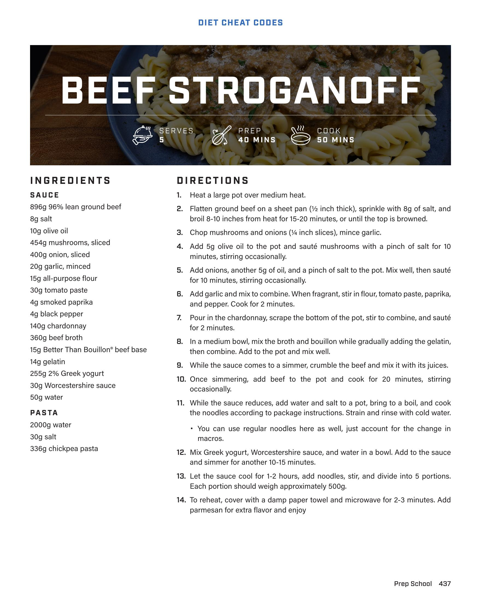

# BEEF STROGANOFF

**Serves:** 5 | **Prep:** 40 MINS | **Cook:** 50 MINS

## Macros

| Calories | Fat | Carbs | Net Carbs | Protein |
|----------|-----|-------|-----------|---------|
| 0 |  |  | undefined |  |

## Ingredients

### SAUCE

- 896g 96% lean ground beef
- 8g salt
- 10g olive oil
- 454g mushrooms, sliced
- 400g onion, sliced
- 20g garlic, minced
- 15g all-purpose flour
- 30g tomato paste
- 4g smoked paprika
- 4g black pepper
- 140g chardonnay
- 360g beef broth
- 15g Better Than Bouillon® beef base
- 14g gelatin
- 255g 2% Greek yogurt
- 30g Worcestershire sauce
- 50g water

### PASTA

- 2000g water
- 30g salt
- 336g chickpea pasta

## Directions

1. Heat a large pot over medium heat.
2. Flatten ground beef on a sheet pan (½ inch thick), sprinkle with 8g of salt, and broil 8-10 inches from heat for 15-20 minutes, or until the top is browned.
3. Chop mushrooms and onions (¼ inch slices), mince garlic.
4. Add 5g olive oil to the pot and sauté mushrooms with a pinch of salt for 10 minutes, stirring occasionally.
5. Add onions, another 5g of oil, and a pinch of salt to the pot. Mix well, then sauté for 10 minutes, stirring occasionally.
6. Add garlic and mix to combine. When fragrant, stir in flour, tomato paste, paprika, and pepper. Cook for 2 minutes.
7. Pour in the chardonnay, scrape the bottom of the pot, stir to combine, and sauté for 2 minutes.
8. In a medium bowl, mix the broth and bouillon while gradually adding the gelatin, then combine. Add to the pot and mix well.
9. While the sauce comes to a simmer, crumble the beef and mix it with its juices.
10. Once simmering, add beef to the pot and cook for 20 minutes, stirring occasionally.
11. While the sauce reduces, add water and salt to a pot, bring to a boil, and cook the noodles according to package instructions. Strain and rinse with cold water.
12. Mix Greek yogurt, Worcestershire sauce, and water in a bowl. Add to the sauce and simmer for another 10-15 minutes.
13. Let the sauce cool for 1-2 hours, add noodles, stir, and divide into 5 portions. Each portion should weigh approximately 500g.
14. To reheat, cover with a damp paper towel and microwave for 2-3 minutes. Add parmesan for extra flavor and enjoy

## Tips

You can use regular noodles here as well, just account for the change in macros.

## Source Pages

438
