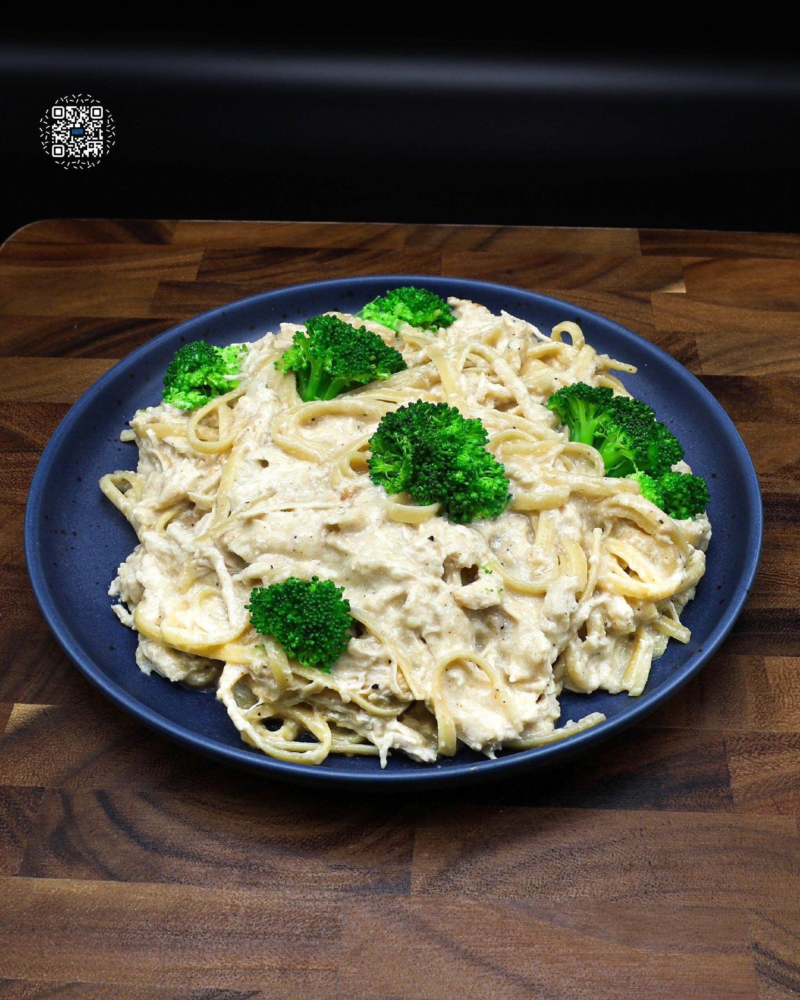
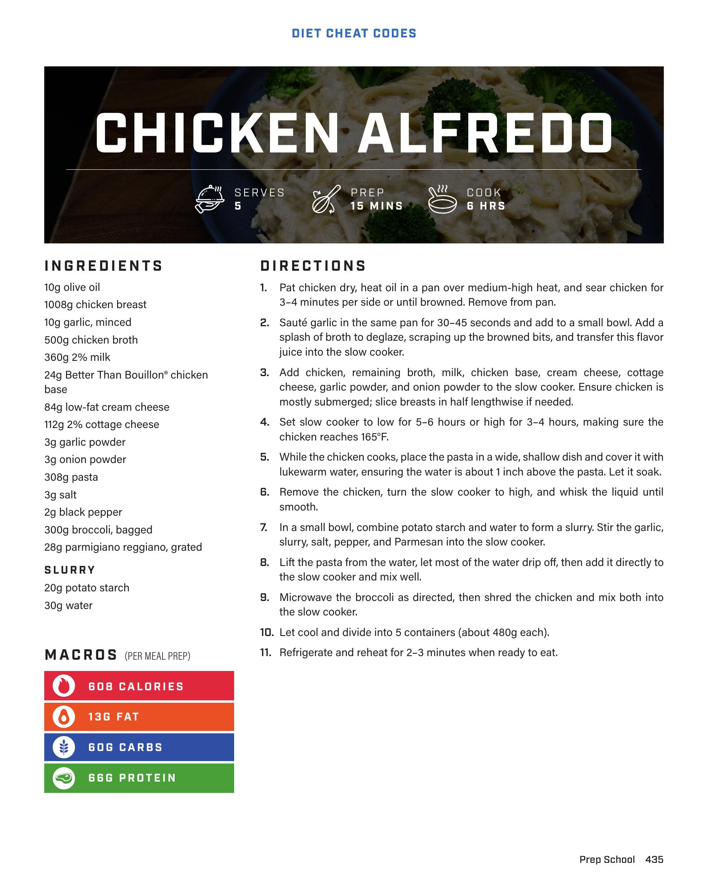
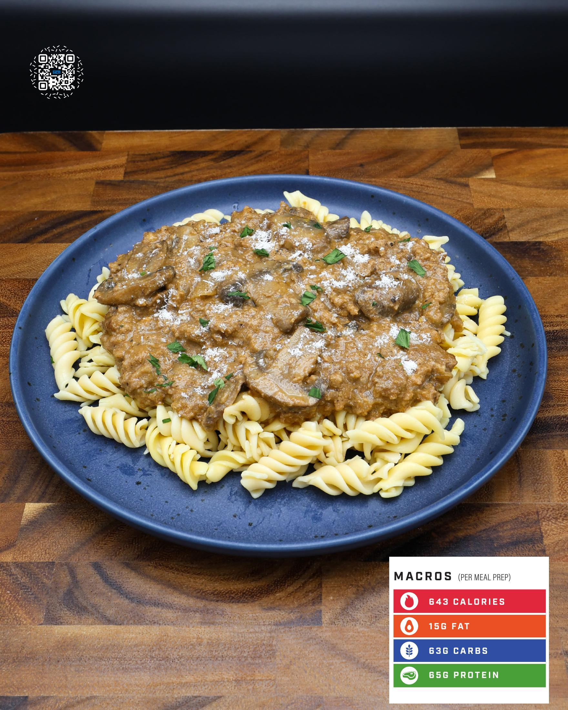

# CHICKEN ALFREDO

**Serves:** 5 | **Prep:** 15 MINS | **Cook:** 8 HRS

## Macros

| Calories | Fat | Carbs | Net Carbs | Protein |
|----------|-----|-------|-----------|---------|
| 608 | 13 | 60 | undefined | 66 |

## Ingredients

- 10g olive oil
- 1000g chicken breast
- 10g garlic, minced
- 500g chicken broth
- 360g 2% milk
- 24g Better Than Bouillon™ chicken base
- 84g low-fat cream cheese
- 112g 2% cottage cheese
- 3g garlic powder
- 3g onion powder
- 308g pasta
- 3g salt
- 2g black pepper
- 300g broccoli, bagged
- 28g parmigiano reggiano, grated

### SLURRY

- 20g potato starch
- 30g water

## Directions

1. Pat chicken dry, heat oil in a pan over medium-high heat, and sear chicken for 3-4 minutes per side or until browned. Remove from pan.
2. Sauté garlic in the same pan for 30-45 seconds and add to a small bowl. Add a splash of broth to deglaze, scraping up the browned bits, and transfer this flavor juice into the slow cooker.
3. Add chicken, remaining broth, milk, chicken base, cream cheese, cottage cheese, garlic powder, and onion powder to the slow cooker. Ensure chicken is mostly submerged; slow breasts in half lengthwise if needed.
4. Set slow cooker to low for 5-6 hours or high for 3-4 hours, making sure the chicken reaches 165°F.
5. While the chicken cooks, place the pasta in a wide, shallow dish and cover it with lukewarm water, ensuring the water is about 1 inch above the pasta. Let it soak.
6. Remove the chicken, turn the slow cooker to high, and whisk the liquid until smooth.
7. In a small bowl, combine potato starch and water to form a slurry. Stir the garlic, slurry, salt, pepper, and Parmesan into the slow cooker.
8. Lift the pasta from the water, let most of the water drip off, then add it directly to the slow cooker and mix well.
9. Microwave the broccoli as directed, then shred the chicken and mix both into the slow cooker.
10. Let cool and divide into 5 containers (about 480g each).
11. Refrigerate and reheat for 2-3 minutes when ready to eat.

## Additional Recipe Pages

## Source Pages

435, 436, 437
