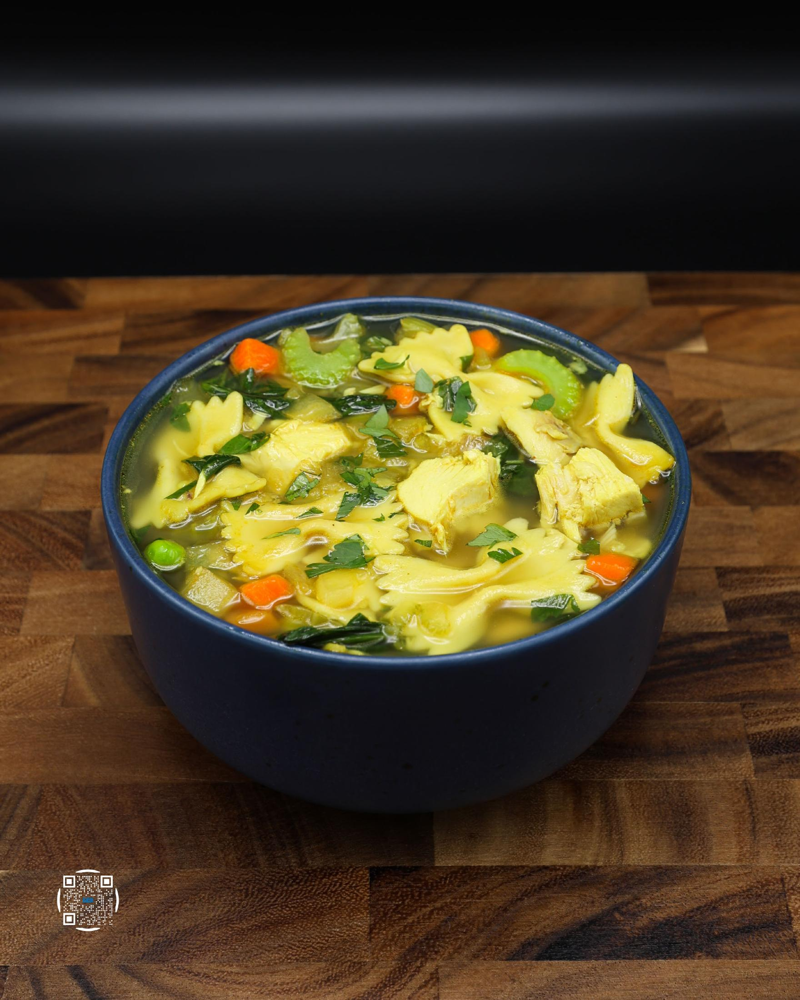
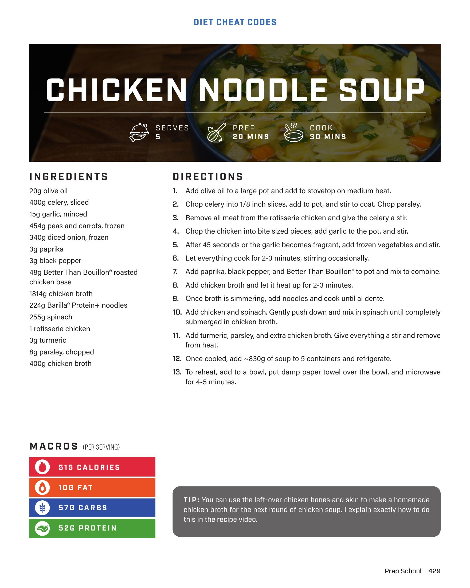
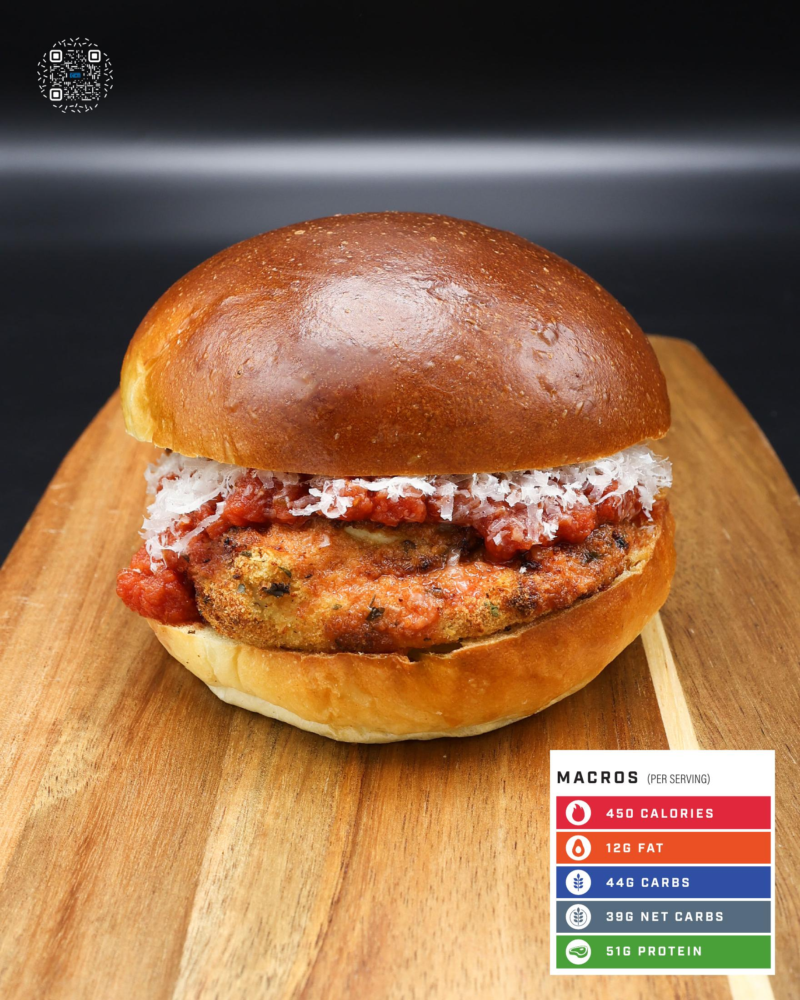

# CHICKEN NOODLE SOUP

**Serves:** 5 | **Prep:** 20 MINS | **Cook:** 30 MINS

## Macros

| Calories | Fat | Carbs | Net Carbs | Protein |
|----------|-----|-------|-----------|---------|
| 515 | 10 | 57 | N/A | 52 |

## Ingredients

- 20g olive oil
- 400g celery, sliced
- 15g garlic, minced
- 454g peas and carrots, frozen
- 340g diced onion, frozen
- 3g paprika
- 3g black pepper
- 48g Better Than Bouillon® roasted chicken base
- 1014g chicken broth
- 224g Barilla® Protein+ noodles
- 255g spinach
- 1 rotisserie chicken
- 3g turmeric
- 8g parsley, chopped
- 400g chicken broth

## Directions

1. Add olive oil to a large pot and add to stovetop on medium heat.
2. Chop celery into 1/8 inch slices, add to pot, and stir to coat. Chop parsley.
3. Remove all meat from the rotisserie chicken and give the celery a stir.
4. Chop the chicken into bite sized pieces, add garlic to the pot, and stir.
5. After 45 seconds or the garlic becomes fragrant, add frozen vegetables and stir.
6. Let everything cook for 2-3 minutes, stirring occasionally.
7. Add paprika, black pepper, and Better Than Bouillon® to pot and mix to combine.
8. Add chicken broth and let it heat up for 2-3 minutes.
9. Once broth is simmering, add noodles and cook until al dente.
10. Add chicken and spinach. Gently push down and mix in spinach until completely submerged in chicken broth.
11. Add turmeric, parsley, and extra chicken broth. Give everything a stir and remove from heat.
12. Once cooled, add ~830g of soup to 5 containers and refrigerate.
13. To reheat, add to a bowl, put damp paper towel over the bowl, and microwave for 4-5 minutes.

## Tips

You can use the left-over chicken bones and skin to make a homemade chicken broth for the next round of chicken soup. I explain exactly how to do this in the recipe video.

## Additional Recipe Pages

## Source Pages

429, 430, 431
