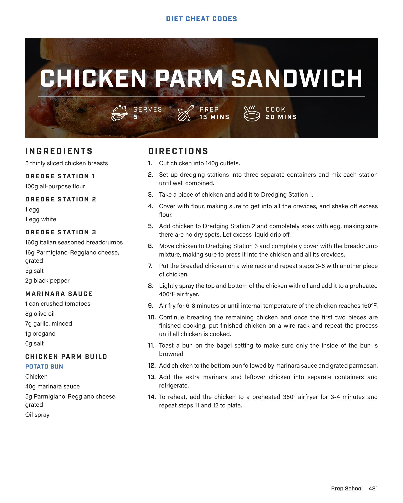

# CHICKEN PARM SANDWICH

**Serves:** 5 | **Prep:** 15 MINS | **Cook:** 20 MINS

## Macros

| Calories | Fat | Carbs | Net Carbs | Protein |
|----------|-----|-------|-----------|---------|
| 0 |  |  | N/A |  |

## Ingredients

- 5 thinly sliced chicken breasts

### DREDGE STATION 1

- 100g all-purpose flour

### DREDGE STATION 2

- 1 egg
- 1 egg white

### DREDGE STATION 3

- 160g italian seasoned breadcrumbs
- 16g Parmigiano-Reggiano cheese, grated
- 5g salt
- 2g black pepper

### MARINARA SAUCE

- 1 can crushed tomatoes
- 8g olive oil
- 7g garlic, minced
- 1g oregano
- 6g salt

### CHICKEN PARM BUILD

- POTATO BUN
- Chicken
- 40g marinara sauce
- 5g Parmigiano-Reggiano cheese, grated
- Oil spray

## Directions

1. Cut chicken into 140g cutlets.
2. Set up dredging stations into three separate containers and mix each station until well combined.
3. Take a piece of chicken and add it to Dredging Station 1.
4. Cover with flour, making sure to get into all the crevices, and shake off excess flour.
5. Add chicken to Dredging Station 2 and completely soak with egg, making sure there are no dry spots. Let excess liquid drip off.
6. Move chicken to Dredging Station 3 and completely cover with the breadcrumb mixture, making sure to press it into the chicken and all its crevices.
7. Put the breaded chicken on a wire rack and repeat steps 3-6 with another piece of chicken.
8. Lightly spray the top and bottom of the chicken with oil and add it to a preheated 400°F air fryer.
9. Air fry for 6-8 minutes or until internal temperature of the chicken reaches 160°F.
10. Continue breading the remaining chicken and once the first two pieces are finished cooking, put finished chicken on a wire rack and repeat the process until all chicken is cooked.
11. Toast a bun on the bagel setting to make sure only the inside of the bun is browned.
12. Add chicken to the bottom bun followed by marinara sauce and grated parmesan.
13. Add the extra marinara and leftover chicken into separate containers and refrigerate.
14. To reheat, add the chicken to a preheated 350° airfryer for 3-4 minutes and repeat steps 11 and 12 to plate.

## Source Pages

432
