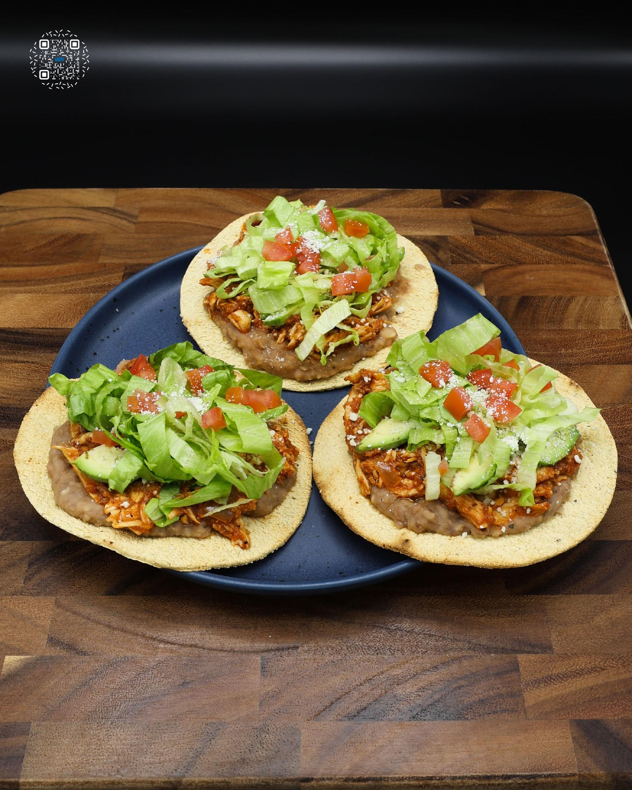
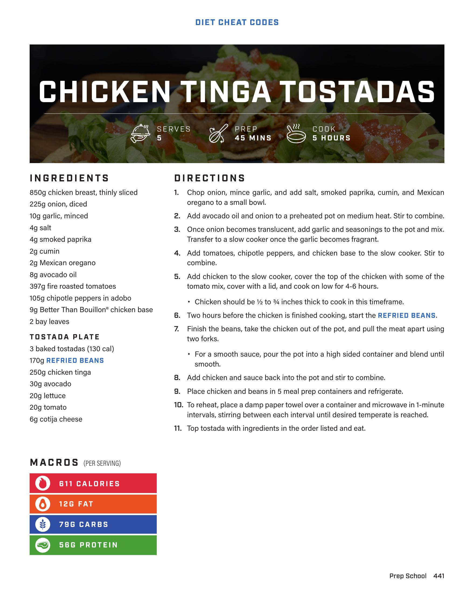

# CHICKEN TINGA TOSTADAS

**Serves:** 5 | **Prep:** 45 MINS | **Cook:** 5 HOURS

## Macros

| Calories | Fat | Carbs | Net Carbs | Protein |
|----------|-----|-------|-----------|---------|
| 611 | 12 | 79 | undefined | 56 |

## Ingredients

- 850g chicken breast, thinly sliced
- 225g onion, diced
- 10g garlic, minced
- 4g salt
- 4g smoked paprika
- 2g cumin
- 2g Mexican oregano
- 8g avocado oil
- 397g fire roasted tomatoes
- 105g chipotle peppers in adobo
- 9 Better Than Bouillon™ chicken base
- 2 bay leaves

### TOSTADA PLATE

- 3 baked tostadas (130 cal)
- 170g REFRIED BEANS
- 250g chicken tinga
- 30g avocado
- 20g lettuce
- 20g tomato
- 6g cotija cheese

## Directions

1. Chop onion, mince garlic, and add salt, smoked paprika, cumin, and Mexican oregano to a small bowl.
2. Add avocado oil and onion to a preheated pot on medium heat. Stir to combine.
3. Once onion becomes translucent, add garlic and seasonings to the pot and mix. Transfer to a slow cooker once the garlic becomes fragrant.
4. Add tomatoes, chipotle peppers, and chicken base to the slow cooker. Stir to combine.
5. Add chicken to the slow cooker, cover the top of the chicken with some of the tomato mix, cover with a lid, and cook on low for 4-6 hours. Chicken should be ½ to ¾ inches thick to cook in this timeframe.
6. Two hours before the chicken is finished cooking, start the REFRIED BEANS.
7. Finish the beans, take the chicken out of the pot, and pull the meat apart using two forks. For a smooth sauce, pour the pot into a high sided container and blend until smooth.
8. Add chicken and sauce back into the pot and stir to combine.
9. Place chicken and beans in 5 meal prep containers and refrigerate.
10. To reheat, place a damp paper towel over a container and microwave in 1-minute intervals, stirring between each interval until desired temperate is reached.
11. Top tostada with ingredients in the order listed and eat.

## Additional Recipe Pages

## Source Pages

441, 442
