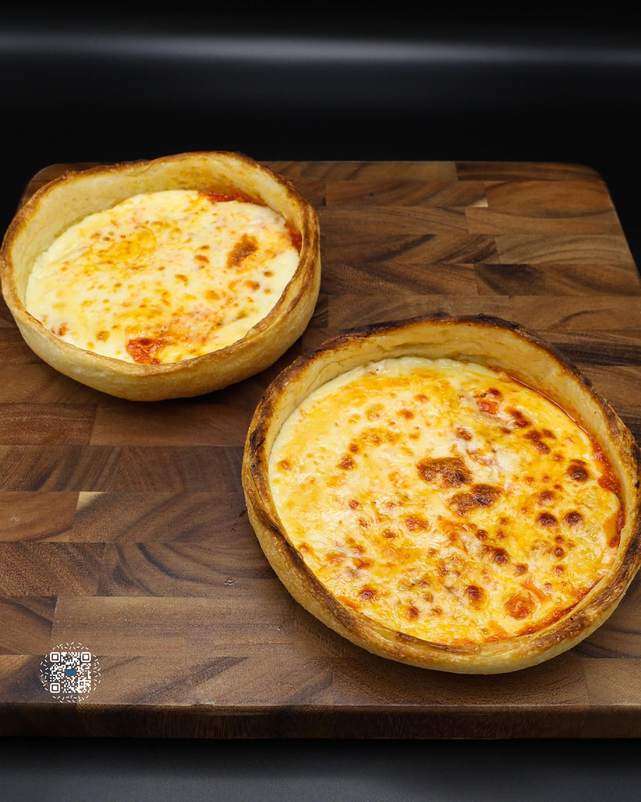

# PIZZA POT PIE MEAL PREP

**Serves:** 5 | **Prep:** 60 MINS | **Cook:** 15 MINS

## Macros

| Calories | Fat | Carbs | Net Carbs | Protein |
|----------|-----|-------|-----------|---------|
| 585 | 17 | 69 | N/A | 41 |

## Ingredients

### DOUGH

- 405g all-purpose flour
- 5g salt
- 3g instant yeast
- 250g water

### SAUCE

- 10g olive oil
- 80g onion, grated
- 7g garlic
- 1g dried oregano
- 794g Red Gold® crushed tomatoes
- 5g salt

### POT PIE BUILD

- 1 dough
- 65g part-skim mozzarella, sliced
- 40g fat-free mozzarella, shredded
- 65g sauce
- 3g butter, melted
- Oil spray

## Directions

1. Add flour, salt, and yeast to a large bowl. Whisk to combine.
2. Add water and mix the ingredients using a spoon until a shaggy dough forms. Go in with a wet hand, press the dough down, and fold it onto itself. The goal is to get all of the dry ingredients mixed in.
3. Once the dough is fully hydrated, cover for 20 minutes.
4. Using a wet hand, perform a stretch and fold by pulling one side of the dough as high as possible then folding it over itself.
5. Turn the bowl 90 degrees and repeat 3-4 more times until all dough has been stretched.
6. Flip the dough over and form into a ball by sliding your hand underneath the dough and pulling it in a circular motion towards your body.
7. Cover the dough for 20 minutes and repeat steps 4-6. Cover for an additional 20 minutes.
8. Divide the dough into 5 pieces. Each piece should weigh roughly 130g.
9. Form each piece into individual balls by flattening the dough with your fingers, folding each side of the dough into the middle, flipping it over, and rolling it in a circular motion until a ball is formed.
10. Grab 5 high-sided containers, lightly spray oil into each one, put a dough ball into each container, cover with a lid, and refrigerate for 24 hours.
11. Add olive oil and onion to a preheated pot on medium heat and mix. Sauté onion for 2-3 minutes, add garlic and oregano, and stir.
12. Once garlic becomes fragrant, add tomatoes and salt. Stir to combine. When the sauce starts bubbling or boiling, reduce the heat to low, give the pot a mix, and simmer for 15-20 minutes.
13. After cooling, transfer the sauce to a high-sided container and refrigerate.
14. Grab a ceramic bowl that is about 6" wide and 1.5" deep. Lightly spray with oil.
15. Add slices of mozzarella to the bowl, followed by the fat-free mozzarella and sauce.
16. Grab the outside of the dough and rotate it in a circle, letting gravity stretch it out until it is big enough to cover the entire bowl.
17. Lay the dough over the top of the bowl and pat the edges of the dough.

