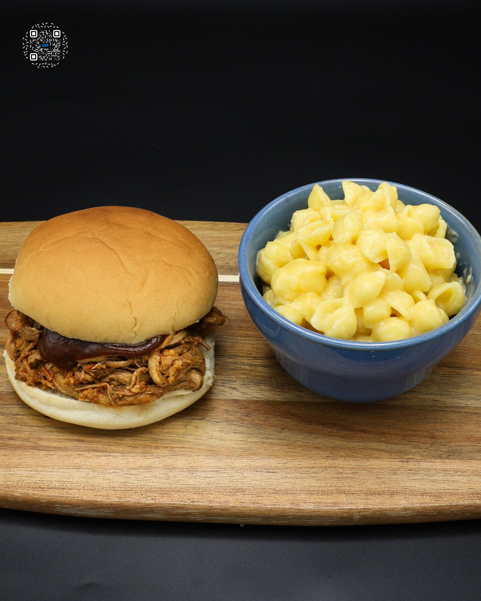
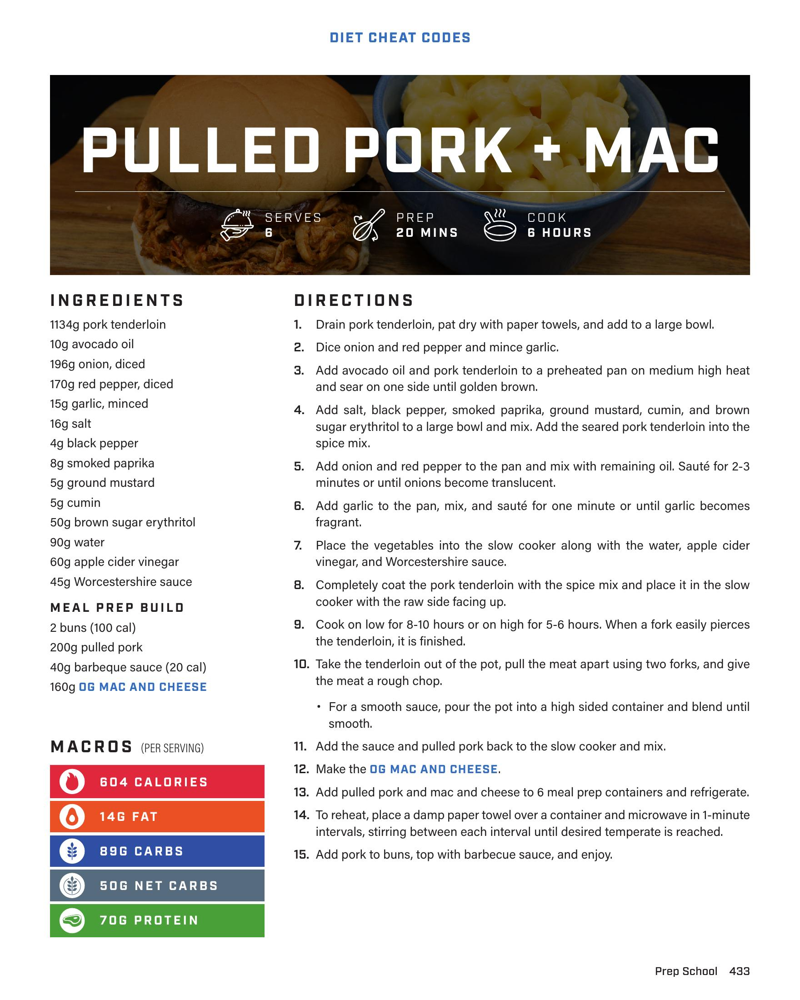

# PULLED PORK + MAC

**Serves:** 6 | **Prep:** 20 MINS | **Cook:** 8 HOURS

## Macros

| Calories | Fat | Carbs | Net Carbs | Protein |
|----------|-----|-------|-----------|---------|
| 604 | 14 | 89 | 50 | 70 |

## Ingredients

- 1134g pork tenderloin
- 10g avocado oil
- 196g onion, diced
- 170g red pepper, diced
- 15g garlic, minced
- 16g salt
- 4g black pepper
- 8g smoked paprika
- 5g ground mustard
- 5g cumin
- 50g brown sugar erythritol
- 90g water
- 60g apple cider vinegar
- 45g Worcestershire sauce

### MEAL PREP BUILD

- 2 buns (100 cal)
- 200g pulled pork
- 40g barbeque sauce (20 cal)
- 160g OG MAC AND CHEESE

## Directions

1. Drain pork tenderloin, pat dry with paper towels, and add to a large bowl.
2. Dice onion and red pepper and mince garlic.
3. Add avocado oil and pork tenderloin to a preheated pan on medium high heat and sear on one side until golden brown.
4. Add salt, black pepper, smoked paprika, ground mustard, cumin, and brown sugar erythritol to a large bowl and mix. Add the seared pork tenderloin into the spice mix.
5. Add onion and red pepper to the pan and mix with remaining oil. Sauté for 2-3 minutes or until onions become translucent.
6. Add garlic to the pan, mix, and sauté for one minute or until garlic becomes fragrant.
7. Place the vegetables into the slow cooker along with the water, apple cider vinegar, and Worcestershire sauce.
8. Completely coat the pork tenderloin with the spice mix and place it in the slow cooker with the raw side facing up.
9. Cook on low for 8-10 hours or on high for 5-6 hours. When a fork easily pierces the tenderloin, it is finished.
10. Take the tenderloin out of the pot, pull the meat apart using two forks, and give the meat a rough chop.
11. For a smooth sauce, pour the pot into a high sided container and blend until smooth.
12. Add the sauce and pulled pork back to the slow cooker and mix.
13. Make the OG MAC AND CHEESE.
14. Add pulled pork and mac and cheese to 6 meal prep containers and refrigerate.
15. To reheat, place a damp paper towel over a container and microwave in 1-minute intervals, stirring between each interval until desired temperate is reached.
16. Add pork to buns, top with barbecue sauce, and enjoy.

## Additional Recipe Pages

## Source Pages

433, 434
