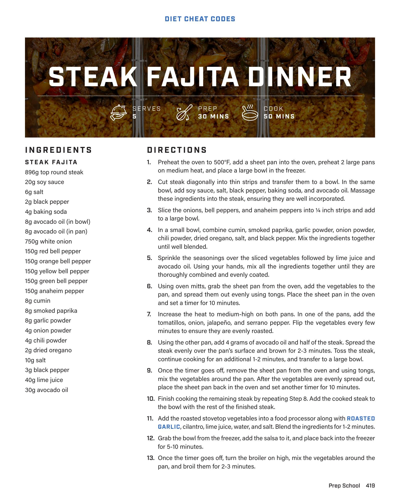

# Steak Fajita Mix and Mexican Rice

**Serves:** 5 | **Prep:**  | **Cook:** 

## Macros

| Calories | Fat | Carbs | Net Carbs | Protein |
|----------|-----|-------|-----------|---------|
| 614 | 19 | 64 | N/A | 52 |

## Ingredients

### MEXICAN RICE

- 8g avocado oil
- 170g white rice, washed
- 150g tomato sauce
- 12g chicken bouillon
- 2g garlic powder
- 2g onion powder
- 2g cumin
- .5g oregano
- 400g chicken broth

### ROASTED SALSA VERDE

- 300g tomatillos
- 50g onion, chopped
- 62g jalapeño
- 21g serrano pepper
- 12g roasted garlic
- 6g cilantro
- 15g lime juice
- 50g water
- 5g salt

## Directions

1. Add the roasted vegetables to the cooked steak and mix thoroughly.
2. Into a medium bowl, add tomato sauce, chicken bouillon, garlic powder, onion powder, cumin, and oregano. Mix thoroughly.
3. Add chicken broth into a measuring cup and microwave for 1-2 minutes or until broth has reached 120°F.
4. Turn the pan that roasted the vegetables onto medium heat, add avocado oil and rice into the pan, and stir to combine. Frequently stir the mixture until the rice has become golden brown.
5. Add the tomato sauce into the pan, stir to combine, and cook for 30 seconds.
6. Add the chicken broth and stir to combine. Once boiling, turn the heat down to low, cover with a lid, and cook for 12 minutes.
7. Keeping the lid on, move the pan off the heat, let it sit for 15 minutes, and stir to combine.
8. To assemble, distribute the steak fajita mix and mexican rice evenly among 5 meal prep containers. Fill 2 oz plastic cups with salsa verde, cover each container with a lid, and refrigerate.
9. When it's time to eat, place a wet paper towel over the meal prep containers and microwave them in 60-second intervals until they are heated through. For more even cooking, mix the ingredients between each interval.

