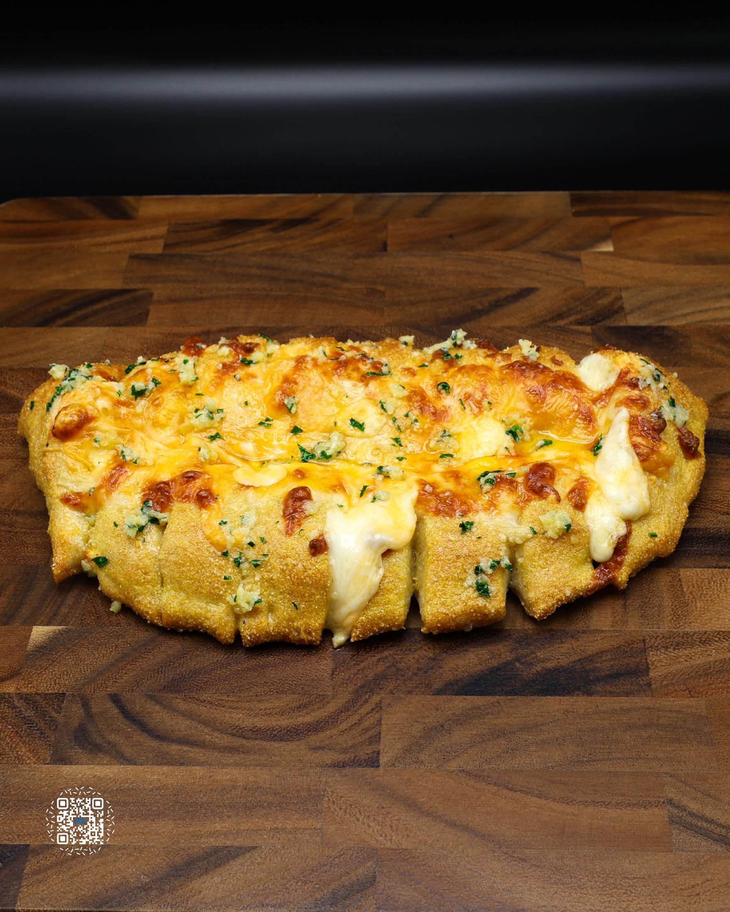
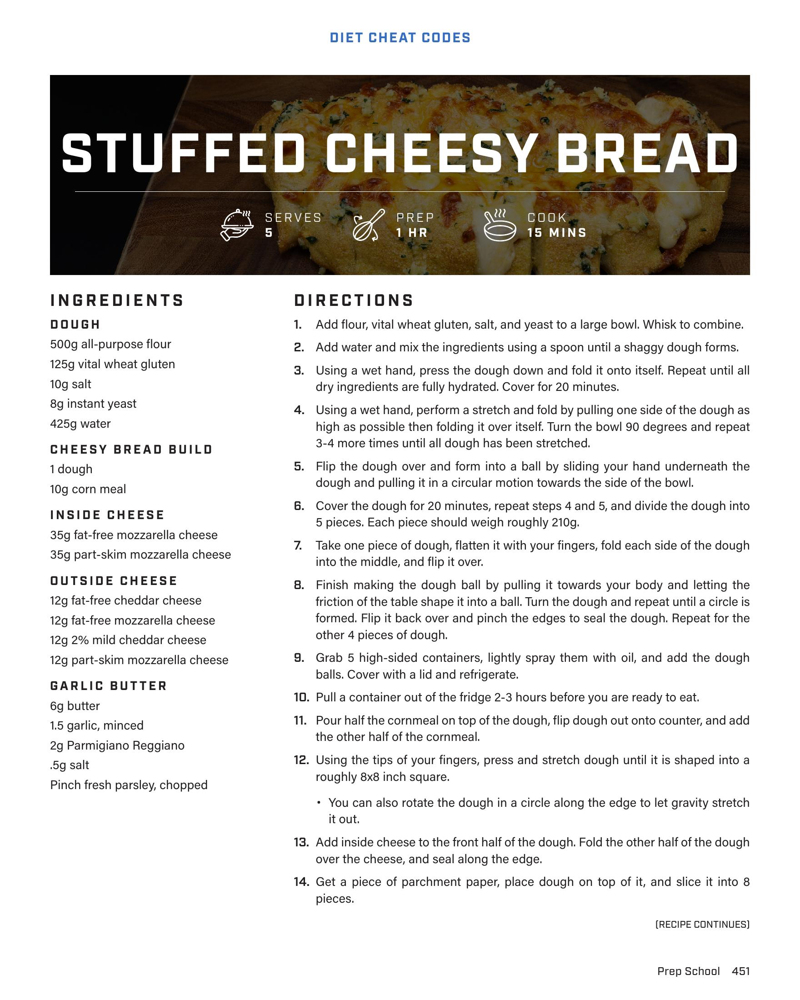
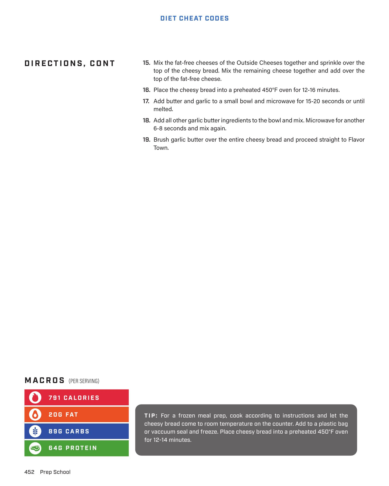

# STUFFED CHEESY BREAD

**Serves:** 5 | **Prep:** 1 HR | **Cook:** 15 MINS

## Macros

| Calories | Fat | Carbs | Net Carbs | Protein |
|----------|-----|-------|-----------|---------|
| 791 | 20 | 89 | undefined | 64 |

## Ingredients

### DOUGH

- 500g all-purpose flour
- 125g vital wheat gluten
- 10g salt
- 8g instant yeast
- 425g water

### CHEESY BREAD BUILD

- 1 dough
- 10g corn meal

### INSIDE CHEESE

- 35g fat-free mozzarella cheese
- 35g part-skim mozzarella cheese

### OUTSIDE CHEESE

- 12g fat-free cheddar cheese
- 12g fat-free mozzarella cheese
- 12g 2% mild cheddar cheese
- 12g part-skim mozzarella cheese

### GARLIC BUTTER

- 6g butter
- 1.5 garlic, minced
- 2g Parmigiano Reggiano
- .5g salt
- Pinch fresh parsley, chopped

## Directions

1. Add flour, vital wheat gluten, salt, and yeast to a large bowl. Whisk to combine.
2. Add water and mix the ingredients using a spoon until a shaggy dough forms.
3. Using a wet hand, press the dough down and fold it onto itself. Repeat until all dry ingredients are fully hydrated. Cover for 20 minutes.
4. Using a wet hand, perform a stretch and fold by pulling one side of the dough as high as possible then folding it over itself. Turn the bowl 90 degrees and repeat 3-4 more times until all dough has been stretched.
5. Flip the dough over and form into a ball by sliding your hand underneath the dough and pulling it in a circular motion towards the side of the bowl.
6. Cover the dough for 20 minutes, repeat steps 4 and 5, and divide the dough into 5 pieces. Each piece should weigh 210g.
7. Take one piece of dough, flatten it with your fingers, fold each side of the dough into the middle, and flip it over.
8. Start making the dough ball by pulling it towards your body and letting the friction on the table shape it into a ball. Turn the dough and repeat until a circle is formed. Flip it back over and pinch the edges to seal the dough. Repeat for the other 4 pieces of dough.
9. Grab 5 high-sided containers, lightly spray them with oil, and add the dough balls. Cover with a lid and refrigerate.
10. Pull a container out of the fridge 2-3 hours before you are ready to eat.
11. Pour half the cornmeal on top of the dough, flip dough out onto counter, and add the other half of the cornmeal.
12. Using the tips of your fingers, press and stretch dough until it is shaped into a roughly 8x8 inch square. You can also rotate the dough in a circle along the edge to let gravity stretch it out.
13. Add inside cheese to the front half of the dough. Fold the other half of the dough over the cheese, and seal along the edge.
14. Get a piece of parchment paper, place dough on top of it, and slice it into 8 pieces.
15. Mix the fat-free cheeses of the Outside Cheeses together and sprinkle over the top of the cheesy bread. Mix the remaining cheese together and add over the top of the fat-free cheese.
16. Place the cheesy bread into a preheated 450°F oven for 12-16 minutes.
17. Add butter and garlic to a small bowl and microwave for 15-20 seconds or until melted.
18. Add all other garlic butter ingredients to the bowl and mix. Microwave for another 6-8 seconds and mix again.
19. Brush garlic butter over the entire cheesy bread and proceed straight to Flavor Town.

## Tips

For a frozen meal prep, cook according to instructions and let the cheesy bread come to room temperature on the counter. Add to a plastic bag or vacuum seal and freeze. Place cheesy bread into a preheated 450°F oven for 12-14 minutes.

## Additional Recipe Pages

## Source Pages

451, 452, 453
