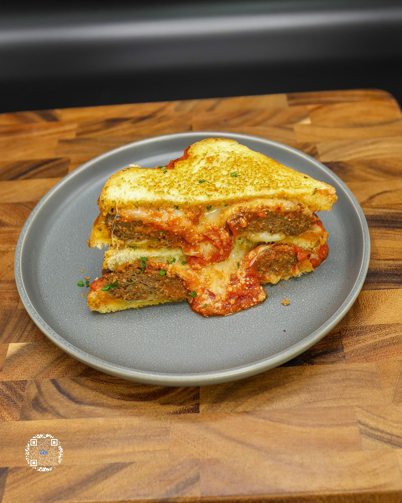

# MEATBALL SANDWICH ON GARLIC BREAD

**Serves:** 1 | **Prep:** 15 MINS | **Cook:** 10 MINS

## Macros

| Calories | Fat | Carbs | Net Carbs | Protein |
|----------|-----|-------|-----------|---------|
| 528 | 38 | 31 | N/A | 44 |

## Ingredients

### GARLIC BREAD SPREAD

- 21g unsalted butter, softened
- 3.5g garlic, minced
- 1g fresh parsley, chopped
- 5g extra virgin olive oil
- 5g parmesan, grated
- 1g salt

### MEATBALL SANDWICH BUILD

- 2 slices bread (45 Cal)
- 28g fat-free mozzarella cheese
- 28g part-skim mozzarella cheese
- 72g ITALIAN SAUSAGE, cooked
- 80g FOOLPROOF HOMEMADE MARINARA
- 5g parmesan, grated

## Directions

1. In a bowl, add softened butter, garlic, parsley, olive oil, grated parmesan, and salt. Mix thoroughly.
2. Evenly spread the butter mix on each slice of bread and add to a preheated pan on medium heat, butter side down.
3. After 3-4 minutes or when the bottom of the bread starts to brown, flip bread and place half of the fat-free mozzarella and half of regular mozzarella on top of each slice.
4. Heat the Italian Sausage up in the microwave for 15 seconds if necessary and add to one of the slices of bread.
5. Turn burner down to low and add HOMEMADE MARINARA, parmesan and other slice of bread cheese side down on top of the sausage.
6. Once both sides of the bread are browned, remove sandwich from heat and put in the microwave for 15 seconds.
7. Cut in half or enjoy it whole.

