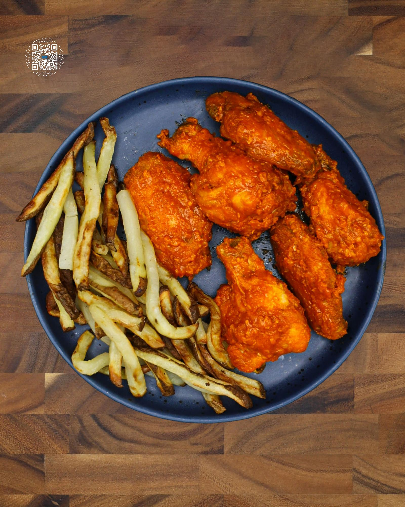

# BUFFALO WING COMBO MEAL

**Serves:** 5 | **Prep:** 40 MINS | **Cook:** 50 MINS

## Macros

| Calories | Fat | Carbs | Net Carbs | Protein |
|----------|-----|-------|-----------|---------|
| 603 | 26 | 49 | N/A | 43 |

## Ingredients

### CHICKEN WINGS

- 15 whole chicken wings
- 8g salt
- 50g all-purpose flour
- 50g cornstarch
- Oil spray

### MEAL PREP BUILD

- 6 chicken wings
- 60g buffalo sauce
- French fries

## Directions

1. Complete steps 1-3 of the NICKDONALD'S FRENCH FRIES.
2. Pat the chicken wings dry with a paper towel. Using a knife, remove wingtips and discard.
3. Using a knife, separate wings into drums and flats. Pat the chicken wings dry with a paper towel.
4. Add salt to both sides of the wings and place in a bowl.
5. Add flour and cornstarch and toss until evenly coated.
6. Add a layer of wings to a preheated 400°F air fryer, lightly spray the top of the wings with oil, and repeat layering/oil combination until all wings are added.
7. Cook for 25 minutes, shaking every 8-10 minutes for even browning.
8. While the wings cook, make the BUFFALO SAUCE.
9. Complete step 4 of the Nickdonald's French Fries.
10. Place finished wings into a large bowl and wipe down the air fryer using paper towels.
11. Complete steps 5-7 of the Nickdonald's French Fries.
12. Once the fries have cooled, separate everything into 5 meal prep containers and refrigerate.
13. When it's time to dig in, place the wings in a preheated 400°F air fryer for 6-8 minutes. Add the fries during the last 3 minutes of the cooking process.
14. Add buffalo sauce and wings into a large bowl and toss to coat. Plate the combo meal and go to town.

## Tips

You can keep the skins of the potatoes on for this meal prep if you prefer. You can buy flats and drums that are already separated; they will just be more expensive.

