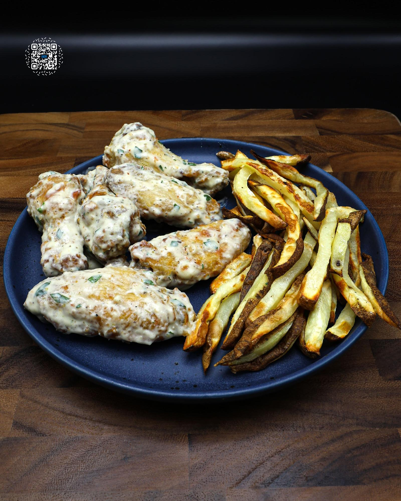

# GARLIC PARMESAN WING COMBO MEAL

**Serves:** 5 | **Prep:** 45 MINS | **Cook:** 90 MINS

## Macros

| Calories | Fat | Carbs | Net Carbs | Protein |
|----------|-----|-------|-----------|---------|
| 618 | 27 | 48 | N/A | 45 |

## Ingredients

### CHICKEN WINGS

- 15 whole chicken wings
- 8g salt
- 50g all-purpose flour
- 50g cornstarch
- Oil spray

### MEAL PREP BUILD

- 6 chicken wings
- 60g garlic parmesan sauce V2
- French fries

## Directions

1. ROAST 2-3 HEADS OF GARLIC.
2. Complete steps 1-3 of the NICKDONALD'S FRENCH FRIES. You can keep the skins of the potatoes on for this meal prep if you prefer.
3. Pat the chicken wings dry with a paper towel. Using a knife, remove wingtips and discard.
4. Using a knife, separate wings into drums and flats. Pat the chicken wings dry with a paper towel. You can buy flats and drums that are already separated; they will just be more expensive.
5. Add salt to both sides of the wings and place in a bowl.
6. Add flour and cornstarch and toss until evenly coated.
7. Add a layer of wings to a preheated 400°F air fryer, lightly spray the top of the wings with oil, and repeat layering/oil combination until all wings are added.
8. Cook for 25 minutes, shaking every 8-10 minutes for even browning.
9. While the wings cook, make the GARLIC PARMESAN SAUCE.
10. Complete step 4 of the Nickdonald's French Fries.
11. Place cooked wings into a large bowl and wipe down the air fryer using paper towels.
12. Complete steps 5-7 of the Nickdonald's French Fries.
13. Once the fries have cooled, separate the wings and fries into 5 meal prep containers and refrigerate.
14. When it's time to dig in, place the wings in a preheated 400°F air fryer for 6-8 minutes. Add the fries during the last 3 minutes of the cooking process.
15. Add wings and garlic parmesan sauce into a large bowl and toss to coat. Plate the combo meal and it's time to eat.

