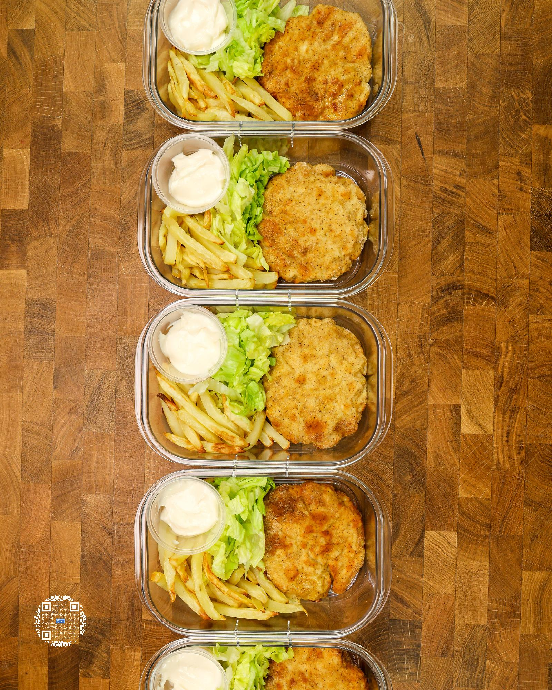

# NICKCHICKEN MEAL PREP

**Serves:** 5 | **Prep:** 45 MINS | **Cook:** 45 MINS

## Macros

| Calories | Fat | Carbs | Net Carbs | Protein |
|----------|-----|-------|-----------|---------|
| 541 | 11 | 72 | N/A | 41 |

## Ingredients

### CHICKEN MIX

- 700g chicken breast
- 9g salt
- 6g granulated erythritol

### WET STATION ONE

- 230g water
- 20g corn starch

### DRY STATION

- 90g all-purpose flour
- 3g garlic powder
- 3g paprika
- 3g salt
- 2g white pepper
- 3g black pepper

### WET STATION TWO

- 1 egg
- 1 egg white
- 2g baking powder

### FINISHING TOUCHES

- Olive oil spray

### NICKCHICKEN BUILD

- Buns (110 Cal)
- 1 NickChicken patty
- 15g light mayonnaise
- Lettuce

### FRENCH FRIES

- 1000g russet potatoes, peeled (about 1200g before peeling)
- 1200g beef broth
- 30g sugar
- 8g oil spray
- Salt, to taste

## Directions

1. Add beef broth and sugar to a large bowl and whisk until sugar is dissolved.
2. Peel potatoes and using a fry tower cutter, cut the potatoes into shoestring french fry size and add to beef broth mixture. Can also cut the fries by hand into 3/8" x 3/8" pieces to replicate the slim profile of a NickDonald's french fry.
3. Once all fries are added to the beef broth, mix fries around to keep them separated. Make sure all fries are covered with broth and set to the side.
4. Preheat an air fryer to 400°F.
5. Cut chicken breast into medium-sized chunks, add to blender, and pulse blender for 10-15 seconds or until it is a similar consistency to ground chicken.
6. Add ground chicken to a bowl, then add salt and erythritol. Mix together until ingredients are thoroughly combined.
7. Spray your hands with oil to prevent the ground chicken from sticking to your hands, then separate the chicken mix into 140g sized balls. Form the chicken balls into patties that are slightly wider than the buns and place on a piece of parchment paper.
8. Set up dredging stations by adding all ingredients to three separate containers and mixing until well combined.
9. With one hand or your "wet hand," take a chicken patty, submerge it into the first wet station container, let extra liquid drip off, and place into the Dry Ingredients container.
10. Using your other hand or what I like to call your "dry hand," add the wet patty to your dry flour mixture and push flour into the patty to coat it thoroughly, making sure the sides of the patty are covered as well.
11. Once patty is fully coated, shake any excess flour off, and add to Wet Station Two.
12. Make sure the chicken patty is completely coated in egg wash and let any excess drip off.
13. Put chicken patty back into the dry station and repeat step 10.
14. Place the finished chicken patty on wire rack and repeat.
15. Spray the bottom of the air fryer and place a patty into the air fryer basket, spraying a light coat of oil on the top of the patty.
16. Cook chicken for 6-8 minutes in the air fryer or until chicken has reached an internal temperature of 165°F, flipping halfway through.
17. Repeat until all chicken is cooked.
18. While patties are cooking, drain broth out of the fries, and add fries to a salad spinner.
19. Use salad spinner to get excess liquid off the fries and place them onto paper towels. If you don't have a salad spinner, paper towels will work by themselves, but you will just have to use more of them.
20. Using paper towels, pat the fries dry and once the final NickChicken is finished, lightly spray the bottom of the air fryer with oil.
21. Add a layer of fries to the air fryer, lightly spray the top of the fries with oil, and repeat layering/oil combination until all fries are added.
22. Cook at 400°F for 20-25 minutes, tossing every 5-6 minutes. Every time the fries are shaken or tossed, lightly spray them with oil.
23. Take fries out, add salt to taste, and shake them to evenly disperse salt.
24. Thinly slice lettuce, add light mayo to condiment cups, lay out 5 meal prep containers, and let NickChickens and fries come to room temperature.
25. Add NickChicken, fries, lettuce, and mayo to each meal prep container and refrigerate.
26. When ready to chow down, toast the inside of a bun, place fries and NickChicken in a preheated 350°F air fryer for 3-4 minutes, plate it, and eat.

## Tips

Put some of the dry mix on a plate or in a separate container before putting patty into the dry station. Then you can easily add the dry mixture to the top of the patty after it is already in the dry station container.

