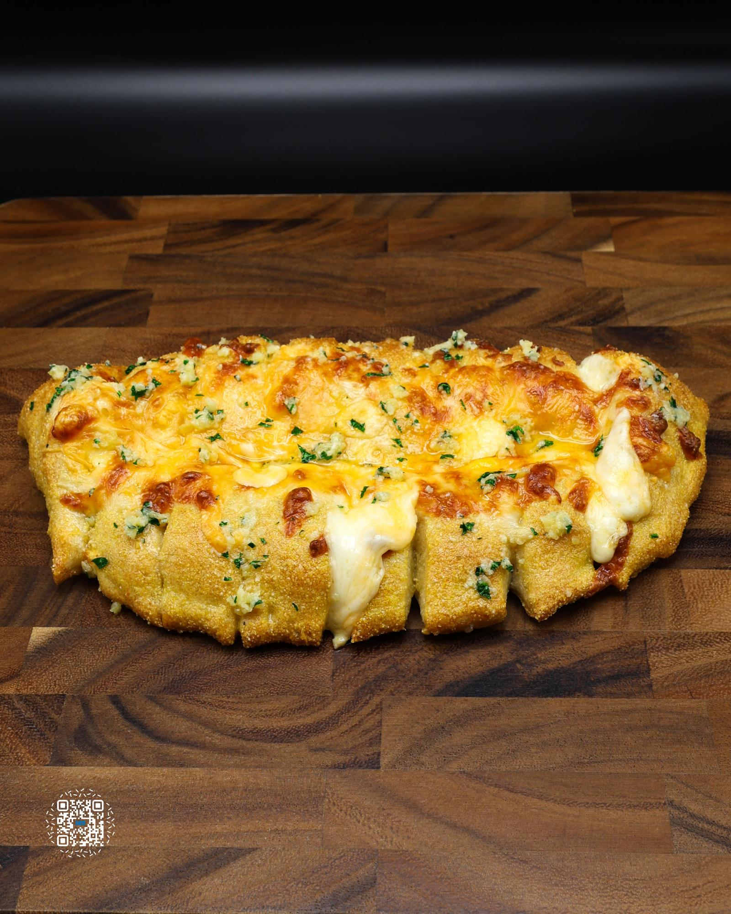

# CHEESY BREAD

**Serves:** 1 | **Prep:** 1.25 HRS | **Cook:** 15 MINS

## Macros

| Calories | Fat | Carbs | Net Carbs | Protein |
|----------|-----|-------|-----------|---------|
| 985 | 29 | 114 | 109 | 75 |

## Ingredients

### DOUGH

### DRY

- 115g all-purpose flour
- 30g vital wheat gluten
- 2g salt
- 3g instant yeast
- 5g granulated erythritol

### WET

- 5g avocado oil
- 1g imitation butter
- 105g water

### COATING

- 30g corn meal

### INSIDE CHEESE

- 42g fat-free mozzarella cheese
- 42g part-skim mozzarella cheese

### OUTSIDE CHEESE

- 14g fat-free cheddar cheese
- 14g fat-free mozzarella cheese
- 14g mild cheddar cheese
- 14g part-skim mozzarella cheese

### TOPPINGS

- 5-6g garlic oil
- Pinch dried parsley

### BATCH GARLIC OIL

- 100g avocado oil (or oil of choice)
- 3g imitation butter
- 4g garlic powder
- 2g salt
- 5g grated parmesan cheese

## Directions

1. Add Dry Ingredients to a food processor and process on high for 15 seconds.
2. Add avocado oil and imitation butter to food processor. Heat water up to 110°F.
3. While processing on high, pour water into the food processor over a 15 second period and continue to process for an additional 30 seconds.
4. Dump dough onto the counter, KNEAD for 1-2 minutes, form into a ball, put it in a lightly oiled bowl, cover, and let rise in a warm place for one hour or until doubled in size.
5. While dough is rising, shred the cheese, make the garlic oil, and/or make a FOOLPROOF HOMEMADE MARINARA for dipping sauce.
6. Pour cornmeal on the top of the dough, flip dough out onto counter, and sprinkle additional cornmeal on the top.
7. Using the tips of your fingers, press and stretch dough until it is shaped into a roughly 9x8" rectangle.
8. Mix Inside Cheese together, then sprinkle the inside cheese mixture on half of the dough. Fold the other half of the dough over the cheese, and seal edge of dough.
9. Rip off 6 inches of parchment paper, place dough on top of it, and slice the folded dough into 8 pieces.
10. Mix the fat-free cheeses of the Outside Cheeses together and sprinkle over the top of the cheesy bread. Mix the rest of the cheeses together and add over the top of the fat-free cheeses.
11. Put the finished cheesy bread into a preheated 450°F oven for 12-16 minutes.
12. Add Toppings and it's time to eat.

