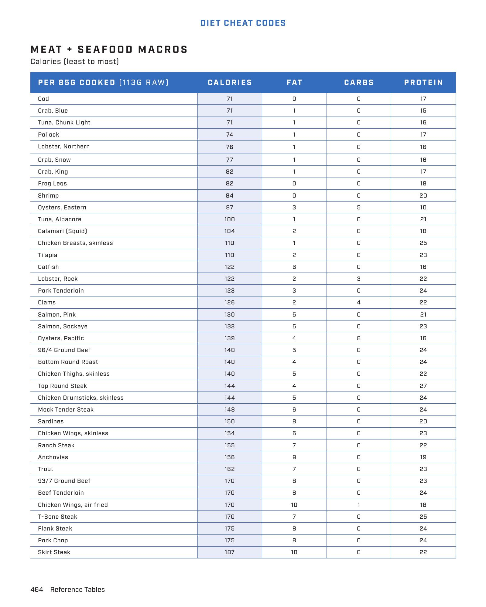

# MEAT + SEAFOOD MACROS, CONT

**Serves:** N/A | **Prep:** N/A | **Cook:** N/A

## Macros

| Calories | Fat | Carbs | Net Carbs | Protein |
|----------|-----|-------|-----------|---------|
| 189 | 11 | 0 | undefined | 21 |

## Ingredients

### PER 85G COOKED (113G RAW)

- Flat Iron Steak
- Pork Sirloin Roast
- 90/10 Ground Beef
- Eel (Unagi)
- Chicken Drumsticks
- Rib Tips
- Caviar
- Filet Mignon
- 85/15 Ground Beef
- Chicken Wings
- Salmon, Atlantic (Farmed)
- Top Sirloin Steak
- New York Strip Steak
- Short Ribs
- Ribeye Steak
- Oxtail
- 80/20 Ground Beef
- Baby Back Ribs
- Boneless Chuck Roast
- Spareribs
- Beef Brisket
- Bacon

## Directions

1. Flat Iron Steak: CALORIES 189, FAT 11, CARBS 0, PROTEIN 21
2. Pork Sirloin Roast: CALORIES 190, FAT 10, CARBS 0, PROTEIN 23
3. 90/10 Ground Beef: CALORIES 200, FAT 11, CARBS 0, PROTEIN 23
4. Eel (Unagi): CALORIES 201, FAT 13, CARBS 0, PROTEIN 20
5. Chicken Drumsticks: CALORIES 204, FAT 11, CARBS 0, PROTEIN 25
6. Rib Tips: CALORIES 210, FAT 12, CARBS 0, PROTEIN 23
7. Caviar: CALORIES 224, FAT 15, CARBS 3, PROTEIN 21
8. Filet Mignon: CALORIES 227, FAT 15, CARBS 0, PROTEIN 23
9. 85/15 Ground Beef: CALORIES 240, FAT 17, CARBS 0, PROTEIN 21
10. Chicken Wings: CALORIES 240, FAT 16, CARBS 0, PROTEIN 23
11. Salmon, Atlantic (Farmed): CALORIES 240, FAT 15, CARBS 0, PROTEIN 23
12. Top Sirloin Steak: CALORIES 242, FAT 16, CARBS 0, PROTEIN 23
13. New York Strip Steak: CALORIES 260, FAT 18, CARBS 0, PROTEIN 23
14. Short Ribs: CALORIES 271, FAT 22, CARBS 0, PROTEIN 19
15. Ribeye Steak: CALORIES 280, FAT 22, CARBS 0, PROTEIN 19
16. Oxtail: CALORIES 288, FAT 19, CARBS 0, PROTEIN 29
17. 80/20 Ground Beef: CALORIES 290, FAT 22, CARBS 0, PROTEIN 19
18. Baby Back Ribs: CALORIES 300, FAT 25, CARBS 0, PROTEIN 19
19. Boneless Chuck Roast: CALORIES 300, FAT 24, CARBS 0, PROTEIN 19
20. Spareribs: CALORIES 313, FAT 26, CARBS 0, PROTEIN 18
21. Beef Brisket: CALORIES 314, FAT 25, CARBS 0, PROTEIN 21
22. Bacon: CALORIES 400, FAT 35, CARBS 0, PROTEIN 30

