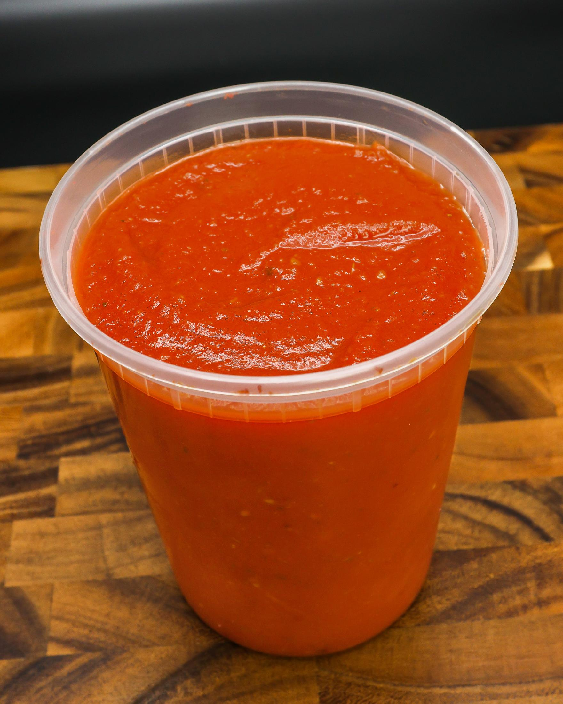
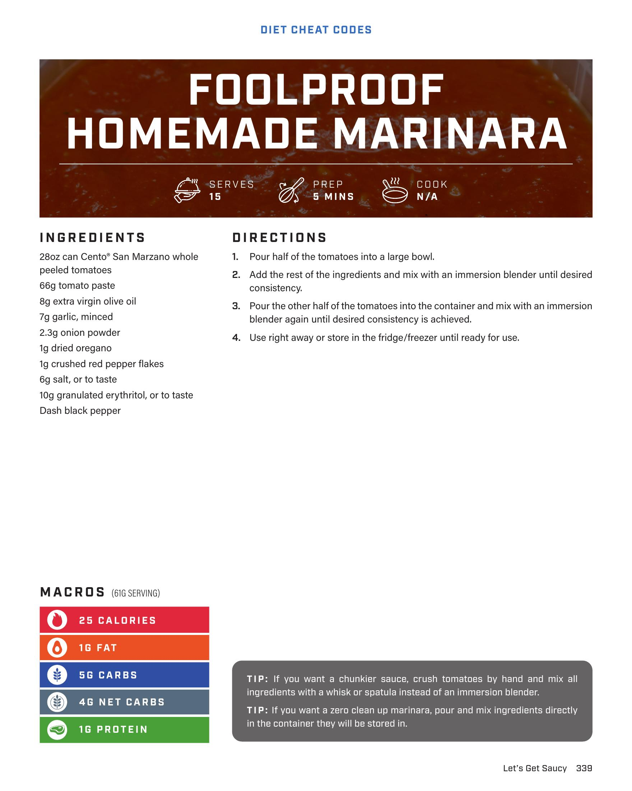

# FOOLPROOF HOMEMADE MARINARA

**Serves:** 15 | **Prep:** 5 MINS | **Cook:** N/A

## Macros

| Calories | Fat | Carbs | Net Carbs | Protein |
|----------|-----|-------|-----------|---------|
| 25 | 1 | 5 | 4 | 1 |

## Ingredients

- 28oz can Cento San Marzano whole peeled tomatoes
- 66g tomato paste
- 8g extra virgin olive oil
- 7g garlic, minced
- 2.3g onion powder
- 1g dried oregano
- 1g crushed red pepper flakes
- 6g salt, or to taste
- 10g granulated erythritol, or to taste
- Dash black pepper

## Directions

1. Pour half of the tomatoes into a large bowl.
2. Add the rest of the ingredients and mix with an immersion blender until desired consistency.
3. Pour the other half of the tomatoes into the container and mix with an immersion blender again until desired consistency is achieved.
4. Use right away or store in the fridge/freezer until ready for use.

## Tips

If you want a chunkier sauce, crush tomatoes by hand and mix all ingredients with a whisk or spatula instead of an immersion blender. If you want a zero stash up marinara, pour and mix ingredients directly in the container they will be stored in.

## Additional Recipe Pages

## Source Pages

339, 340
