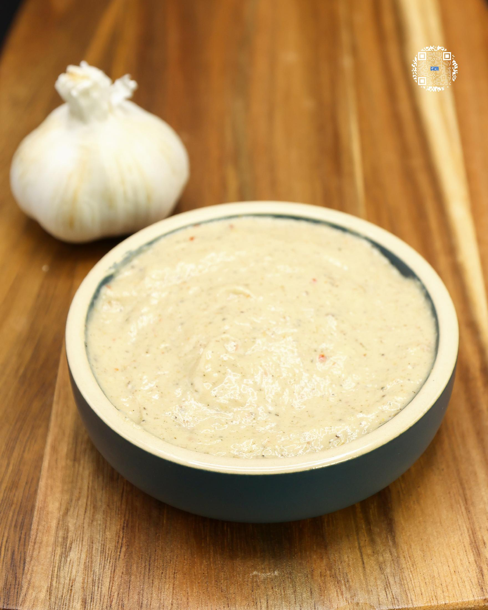
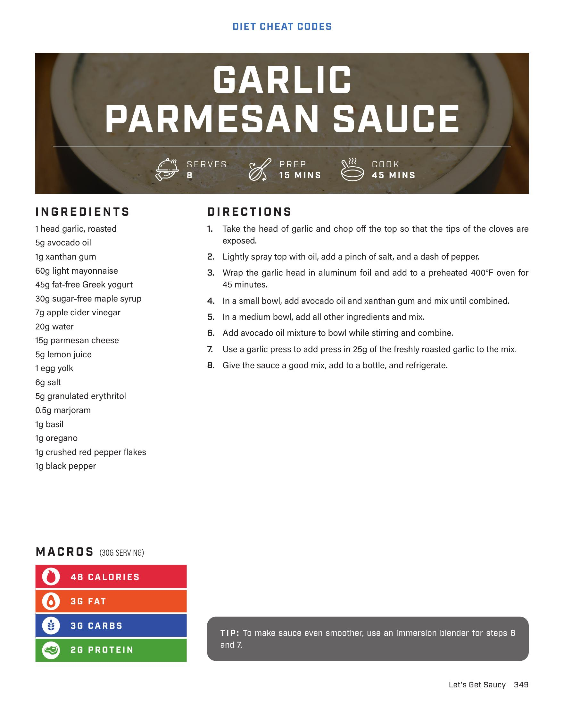

# GARLIC PARMESAN SAUCE

**Serves:** 8 | **Prep:** 15 MINS | **Cook:** 45 MINS

## Macros

| Calories | Fat | Carbs | Net Carbs | Protein |
|----------|-----|-------|-----------|---------|
| 48 | 3 | 3 | undefined | 2 |

## Ingredients

- 1 head garlic, roasted
- 5g avocado oil
- 1g xanthan gum
- 60g light mayonnaise
- 45g fat-free Greek yogurt
- 30g sugar-free maple syrup
- 7g apple cider vinegar
- 20g water
- 15g parmesan cheese
- 5g lemon juice
- 1 egg yolk
- 6g salt
- 5g granulated erythritol
- 30g marjoram
- 1g basil
- 1g oregano
- 1g crushed red pepper flakes
- 1g black pepper

## Directions

1. Take the head of garlic and chop off the top so that the tips of the cloves are exposed.
2. Lightly spray top with oil, add a pinch of salt, and a dash of pepper.
3. Wrap the garlic head in aluminum foil and add to a preheated 400°F oven for 45 minutes.
4. In a small bowl, add avocado oil and xanthan gum and mix until combined.
5. In a medium bowl, add all other ingredients and mix.
6. Add avocado oil mixture to bowl while stirring and combine.
7. Use a garlic press to add press in 25g of the freshly roasted garlic to the mix.
8. Give the sauce a good mix, add to a bottle, and refrigerate.

## Tips

To make sauce even smoother, use an immersion blender for steps 6 and 7.

## Additional Recipe Pages

## Source Pages

349, 350
