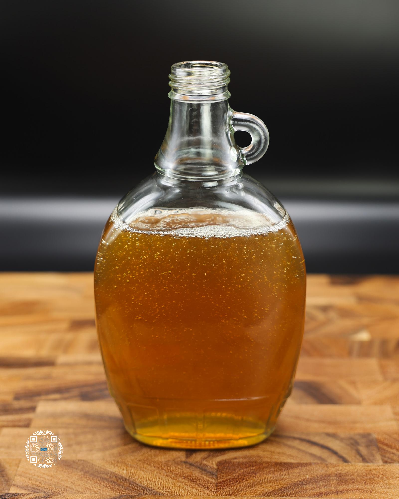

# MAPLE SYRUP

**Serves:** 18 | **Prep:** 10 MINS | **Cook:** 10 MINS

## Macros

| Calories | Fat | Carbs | Net Carbs | Protein |
|----------|-----|-------|-----------|---------|
| 0 | 0 | 4 | 0 | 0 |

## Ingredients

### WET

- 500g water
- 15g maple extract
- 8g imitation vanilla
- 25g brown sugar erythritol

### DRY

- 50g granulated erythritol
- 3.5g salt
- 2g xanthan gum
- .5g sucralose

## Directions

1. Add all wet ingredients into a high sided container.
2. Add 1g butter extract to provide a rich butter flavor to the maple syrup.
3. In a small bowl, add dry ingredients and mix to combine.
4. While blending, slowly add your dry ingredients into the container.
5. Once all dry ingredients have dissolved, continue blending for 2 minutes.
6. Add the syrup to a pot, put on medium heat, and stir every 2-3 minutes.
7. Once boiling, allow to boil for one additional minute, remove from heat, and let it cool.
8. Optional: When cooled, scrape the foam off the top of the syrup and discard.
9. Add syrup to a container and drizzle on all your breakfast favorites.

