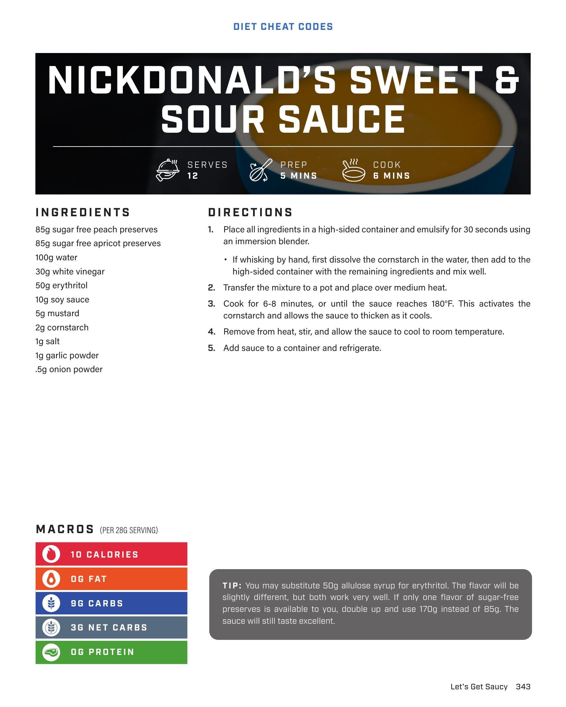

# NICKDONALD'S SWEET & SOUR SAUCE

**Serves:** 12 | **Prep:** 5 MINS | **Cook:** 8 MINS

## Macros

| Calories | Fat | Carbs | Net Carbs | Protein |
|----------|-----|-------|-----------|---------|
| 10 | 0 | 9 | 3 | 0 |

## Ingredients

- 85g sugar free peach preserves
- 85g sugar free apricot preserves
- 100g water
- 30g white vinegar
- 50g erythritol
- 10g soy sauce
- 5g mustard
- 2g cornstarch
- 1g salt
- 1g garlic powder
- .5g onion powder

## Directions

1. Place all ingredients in a high-sided container and emulsify for 30 seconds using an immersion blender.
2. If whisking by hand, first dissolve the cornstarch in the water, then add to the high-sided container with the remaining ingredients and mix well.
3. Transfer the mixture to a pot and place over medium heat.
4. Cook for 6-8 minutes, or until the sauce reaches 180°F. This activates the cornstarch and allows the sauce to thicken as it cools.
5. Remove from heat, stir, and allow the sauce to cool to room temperature.
6. Add sauce to a container and refrigerate.

## Tips

You may substitute 50g allulose syrup for erythritol. The flavor will be slightly different, but both work very well. If only one flavor of sugar-free preserves is available to you, double up and use 170g instead of 85g. The sauce will still taste excellent.

## Additional Recipe Pages

## Source Pages

343, 344
