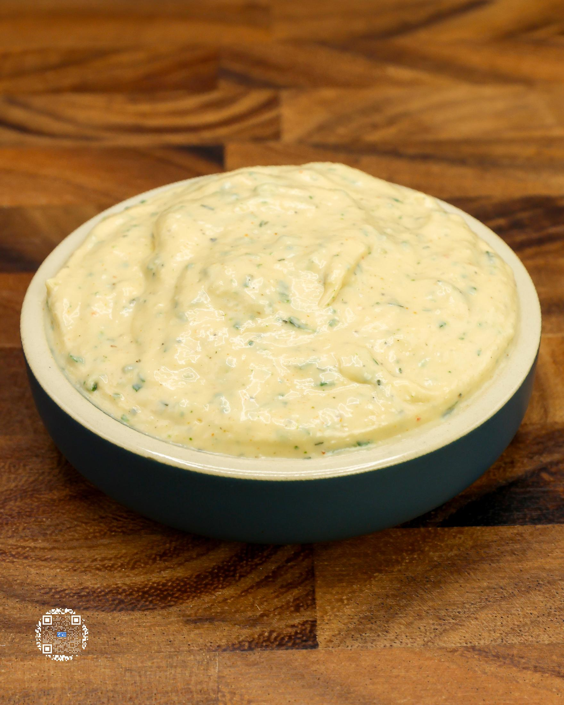
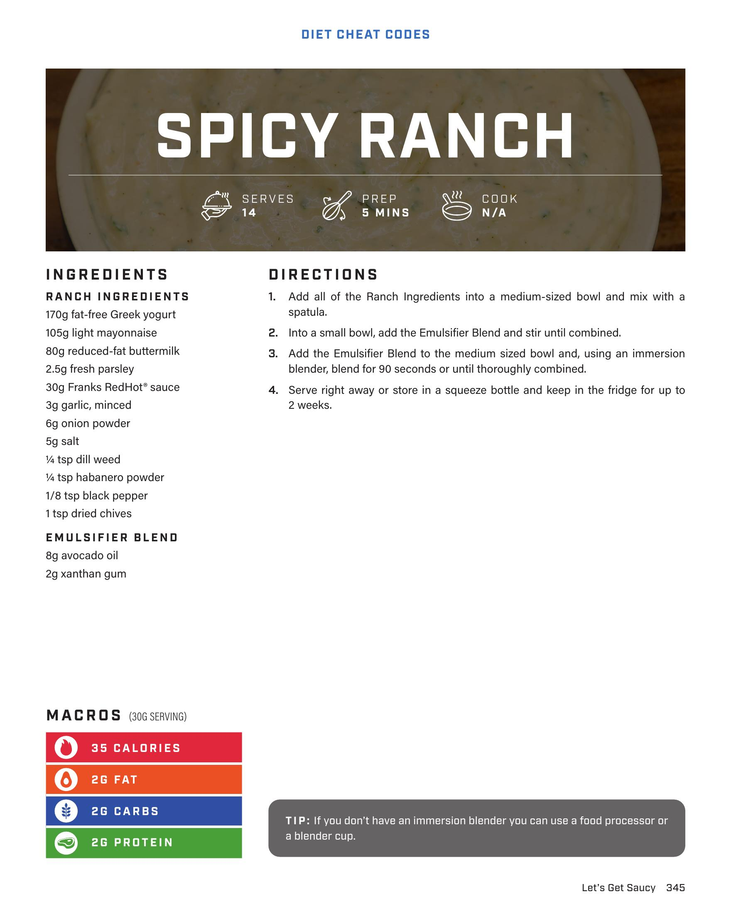

# SPICY RANCH

**Serves:** 14 | **Prep:** 5 MINS | **Cook:** N/A

## Macros

| Calories | Fat | Carbs | Net Carbs | Protein |
|----------|-----|-------|-----------|---------|
| 35 | 2 | 2 | undefined | 2 |

## Ingredients

### RANCH INGREDIENTS

- 170g fat-free Greek yogurt
- 105g light mayonnaise
- 80g reduced-fat buttermilk
- 2.5g fresh parsley
- 30g Franks RedHot® sauce
- 3g garlic, minced
- 6g onion powder
- 5g salt
- 1/4 tsp dill weed
- 1/4 tsp habanero powder
- 1/8 tsp black pepper
- 1 tsp dried chives

### EMULSIFIER BLEND

- 8g avocado oil
- 2g xanthan gum

## Directions

1. Add all of the Ranch Ingredients into a medium-sized bowl and mix with a spatula.
2. Into a small bowl, add the Emulsifier Blend and stir until combined.
3. Add the Emulsifier Blend to the medium sized bowl and, using an immersion blender, blend for 90 seconds or until thoroughly combined.
4. Serve right away or store in a squeeze bottle and keep in the fridge for up to 2 weeks.

## Tips

If you don't have an immersion blender you can use a food processor or a blender cup.

## Additional Recipe Pages

## Source Pages

345, 346
