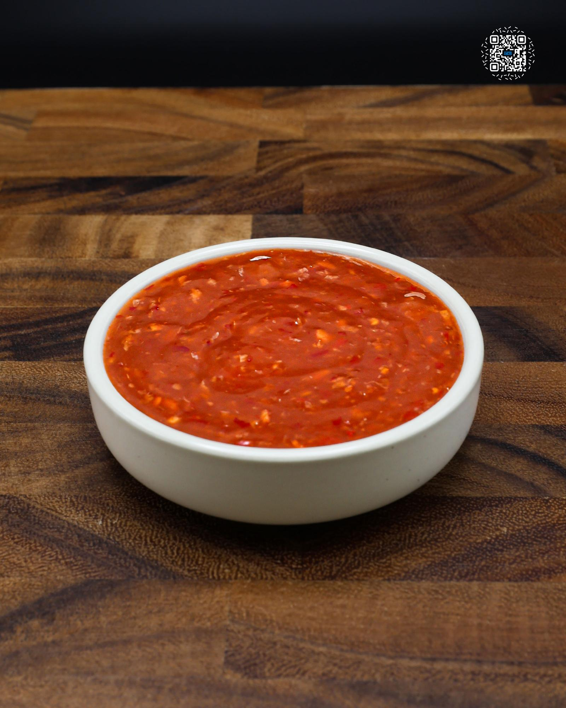

# SWEET CHILI SAUCE

**Serves:** 17 | **Prep:** 10 MINS | **Cook:** 15 MINS

## Macros

| Calories | Fat | Carbs | Net Carbs | Protein |
|----------|-----|-------|-----------|---------|
| 19 | 0 | 9 | 4 | 0 |

## Ingredients

- 120g rice vinegar
- 180g water
- 90g granulated erythritol
- 30g sugar
- 3g salt
- 10g garlic, minced
- 7g ginger, minced
- 30g soy sauce
- 68g chili garlic sauce
- 12g corn starch
- 30g water
- 5g sesame oil
- 1.5g xanthan gum

## Directions

1. Add vinegar, water, erythritol, sugar, salt, garlic, ginger, and soy sauce to a medium pot. Stir ingredients to combine and place on medium heat. Stir every 1-2 minutes.
2. Once erythritol and sugar have dissolved, add chili garlic sauce and stir.
3. Add corn starch and water to a bowl. Use a spoon to mix until the corn starch has completely dissolved into the water.
4. When the pot starts to boil, add corn starch slurry and stir immediately.
5. Let the sauce simmer for 1-2 minutes.
6. Place sesame oil and xanthan gum in a bowl and mix until the xanthan gum has completely dissolved into the oil.
7. If you can't get sesame oil, replace it with avocado oil or another neutral tasting oil.
8. Remove pot from heat, add oil mixture, and stir to combine.
9. Once sauce has reached room temperature, place in a container and refrigerate.

