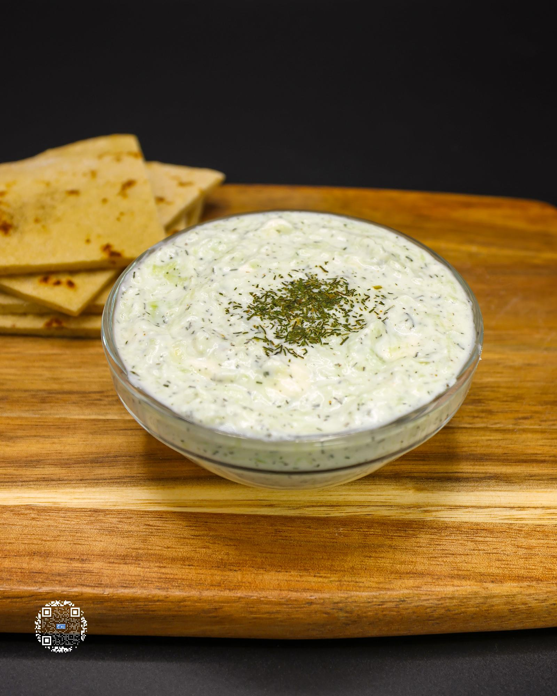

# TZATZIKI SAUCE

**Serves:** 10 | **Prep:** 15 MINS | **Cook:** N/A

## Macros

| Calories | Fat | Carbs | Net Carbs | Protein |
|----------|-----|-------|-----------|---------|
| 18 | 0 | 1 | N/A | 3 |

## Ingredients

- 160g fat-free Greek yogurt
- 4g extra virgin olive oil
- 15g white vinegar
- 1/2 tsp dried dill
- 80g cucumber, peeled, deseeded, and grated
- 3g garlic, minced
- 42g fat-free feta
- 3g salt
- Dash black pepper

## Directions

1. Peel, deseed, grate, and squeeze cucumber with a cheese cloth or paper towels over a sink to try and get as much moisture out as possible.
2. Add all ingredients in a bowl and mix until combined.
3. Serve right away or, for best flavor, cover and refrigerate for at least 2-3 hours.

