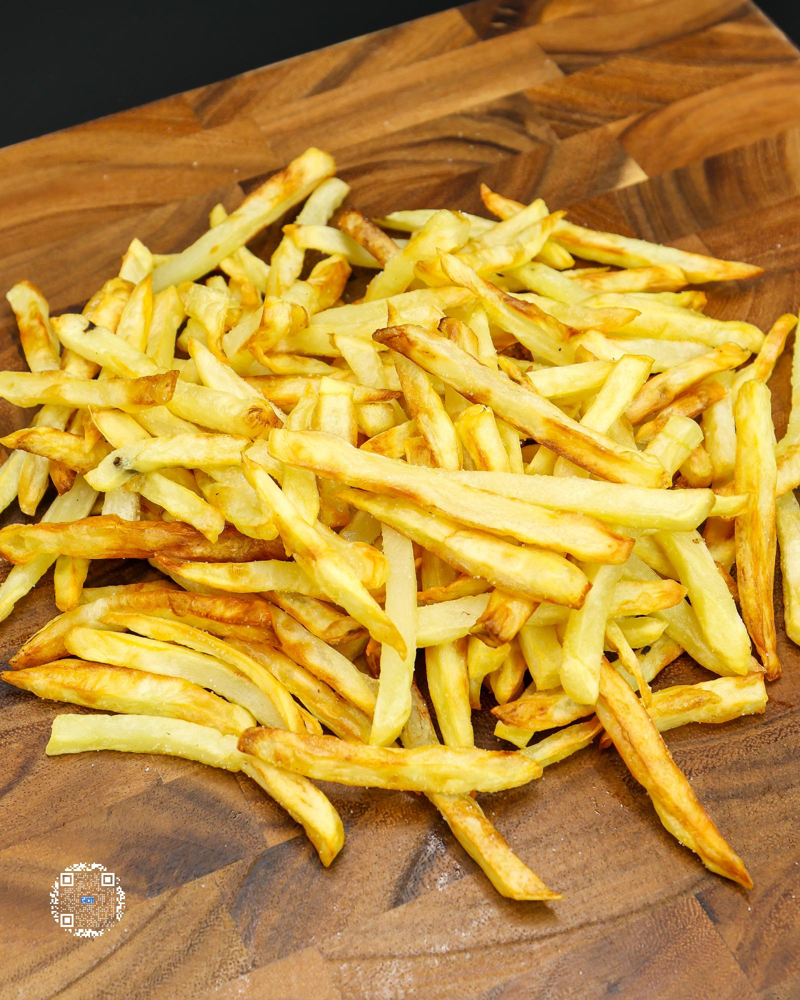

# NICKDONALD'S FRENCH FRIES

**Serves:** 5 | **Prep:** 40 MINS | **Cook:** 20 MINS

## Macros

| Calories | Fat | Carbs | Net Carbs | Protein |
|----------|-----|-------|-----------|---------|
| 172 | 2 | 36 | N/A | 4 |

## Ingredients

- 1000g russet potatoes, peeled (about ~1200g before peeling)
- 1200g beef broth
- 30g sugar
- 8g oil spray
- Salt, to taste

## Directions

1. Add beef broth and sugar into a large bowl and whisk to combine.
2. Peel potatoes and, using a fry tower cutter, cut the potatoes into shoestring french fry size and add to beef broth mixture.  Can also cut the fries by hand into c" x c" pieces to replicate the slim profile of a NickDonalds french fry.
3. Once all fries are added to the beef broth, mix fries around to keep them separated. Make sure all fries are covered with broth and let them marinade for 30 minutes.
4. Drain liquid out of bowl and dry the fries using a salad spinner and/or paper towels.
5. Add a layer of fries to a preheated 400°F air fryer, lightly spray the top of the fries with oil, and repeat layering/oil combination until all fries are added.
6. Cook for 20-25 minutes; tossing every 5-6 minutes.  Every time the fries are shaken or tossed, lightly spray them with oil.
7. Take fries out, add salt to taste, and shake them to evenly disperse salt.
8. Split into 5 portions and store them for use as a side dish to other meals throughout the week.
9. To reheat, simply add them to a preheated 400°F air fryer for 3-4 minutes.

## Tips

Make sure you buy broth with ingredients that are as close to pure beef broth as possible. You want to avoid ones that include celery, carrot, onion, and/or garlic powder.

