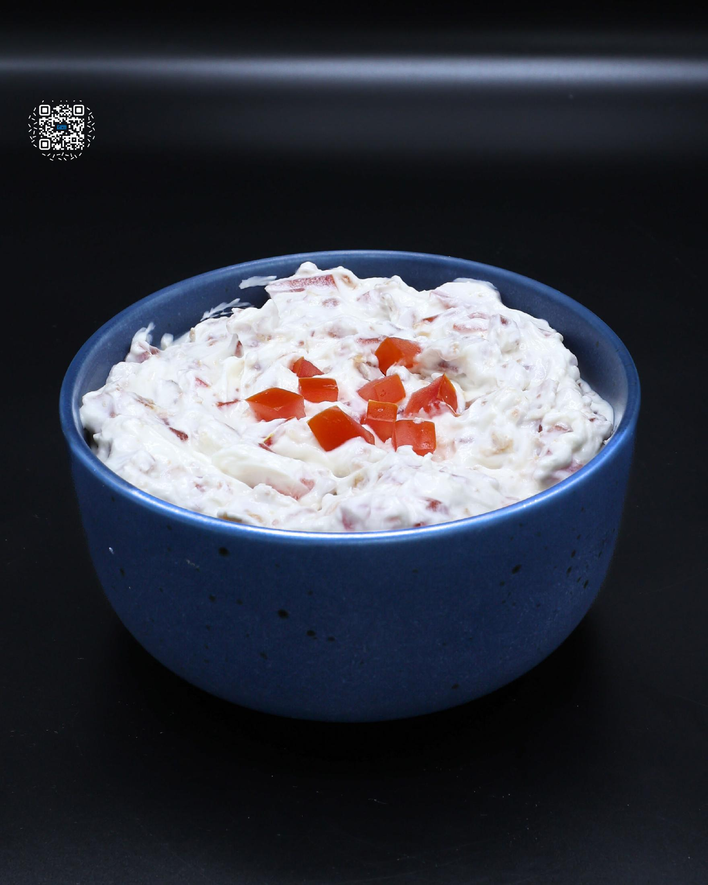

# BLT DIP

**Serves:** 13 | **Prep:** 10 MINS | **Cook:** 10 MINS

## Macros

| Calories | Fat | Carbs | Net Carbs | Protein |
|----------|-----|-------|-----------|---------|
| 78 | 5 | 2 | undefined | 8 |

## Ingredients

- 108g center cut bacon (1 package), chopped
- 450g 0% greek yogurt
- 100g low-fat cream cheese
- 150g tomatoes, chopped

## Directions

1. Let the cream cheese sit at room temperature for 2 to 4 hours before starting this recipe. This will make it MUCH easier to mix into the dip.
2. Arrange the bacon strips evenly on a sheet pan and place in a preheated 450°F oven for 10-14 minutes, or until they reach your preferred level of crispiness.
3. Slice the tomato in half, remove the seeds with a spoon, and then dice the tomato into small, uniform pieces.
4. Add tomato, cream cheese, and greek yogurt to a bowl.
5. Place the cooked bacon on a cutting board, chop into bite-sized pieces, and add to the bowl.
6. Mix all the ingredients together to combine.
7. Enjoy right away or place in the fridge and allow to sit for 24 hours for maximum flavor.

## Tips

I prefer to spend the extra couple minutes cooking fresh bacon to my preferred doneness. However, when short on time, real bacon bits are a great alternative.

## Additional Recipe Pages

## Source Pages

331, 332
