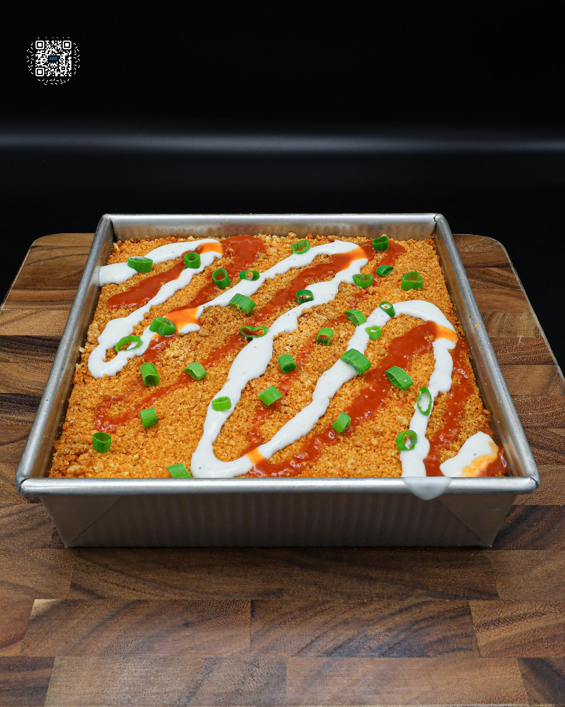
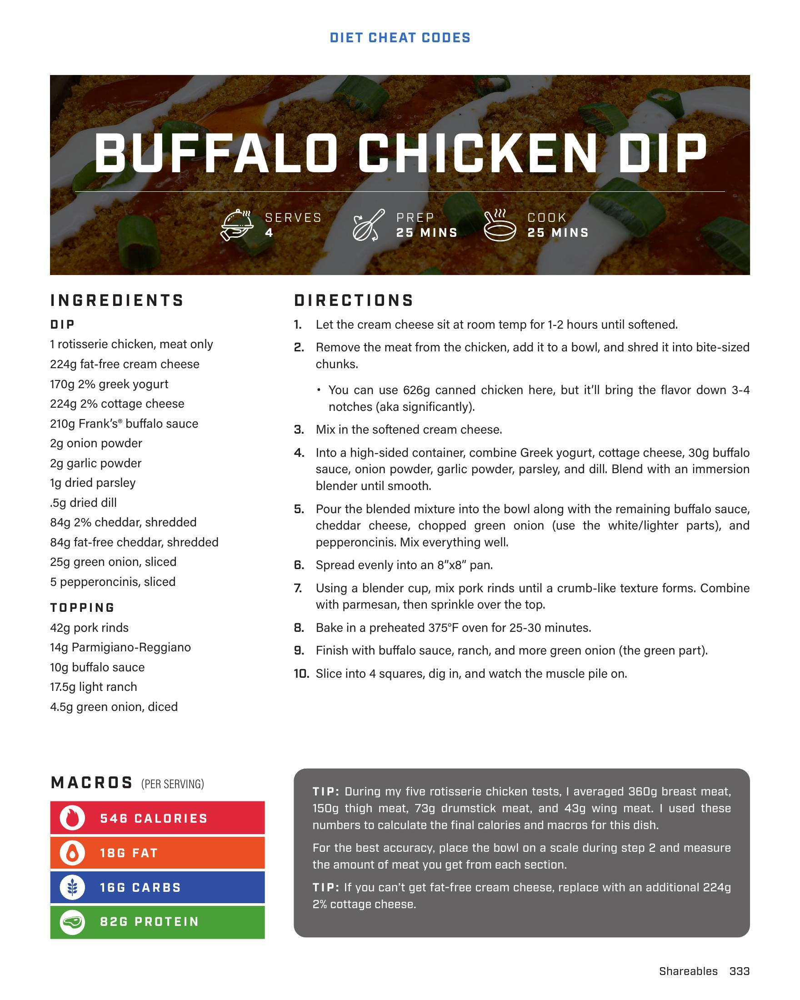

# BUFFALO CHICKEN DIP

**Serves:** 4 | **Prep:** 25 MINS | **Cook:** 25 MINS

## Macros

| Calories | Fat | Carbs | Net Carbs | Protein |
|----------|-----|-------|-----------|---------|
| 546 | 18 | 16 | undefined | 82 |

## Ingredients

### DIP

- 1 rotisserie chicken, meat only
- 224g fat-free cream cheese
- 170g 2% greek yogurt
- 224g cottage cheese
- 210g Frank's buffalo sauce
- 2g onion powder
- 2g garlic powder
- 1g dried parsley
- .5g dried dill
- 84g 2% cheddar, shredded
- 84g fat-free cheddar, shredded
- 25g green onion, sliced
- 5 pepperoncinis, sliced

### TOPPING

- 42g pork rinds
- 14g Parmigiano-Reggiano
- 10g buffalo sauce
- 17.5g light ranch
- 4.5g green onion, diced

## Directions

1. Let the cream cheese sit at room temp for 1-2 hours until softened.
2. Remove the meat from the chicken, add it to a bowl, and shred it into bite-sized chunks. You can use 626g canned chicken here, but it'll bring the flavor down 3-4 notches (aka significantly).
3. Mix in the softened cream cheese.
4. Into a high-sided container, combine Greek yogurt, cottage cheese, 30g buffalo sauce, onion powder, garlic powder, parsley, and dill. Blend with an immersion blender until smooth.
5. Pour the blended mixture into the bowl along with the remaining buffalo sauce, cheddar cheese, chopped green onion (use the white/lighter parts), and pepperoncinis. Mix everything well.
6. Spread evenly into an 8"x8" pan.
7. Using a blender cup, mix pork rinds until a crumb-like texture forms. Combine with parmesan, then sprinkle over the top.
8. Bake in a preheated 375°F oven for 25-30 minutes.
9. Finish with buffalo sauce, ranch, and more green onion (the green part).
10. Slice into 4 squares, dig in, and watch the muscle pile on.

## Tips

During my five rotisserie chicken tests, I averaged 360g breast meat, 150g thigh meat, 73g drumstick meat, and 43g wing meat. I used these numbers to calculate the final calories and macros for this dish. For the best accuracy, place the bowl on a scale during step 2 and measure the amount of meat you get from each section. If you can't get fat-free cream cheese, replace with an additional 224g 2% cottage cheese.

## Additional Recipe Pages

## Source Pages

333, 334
