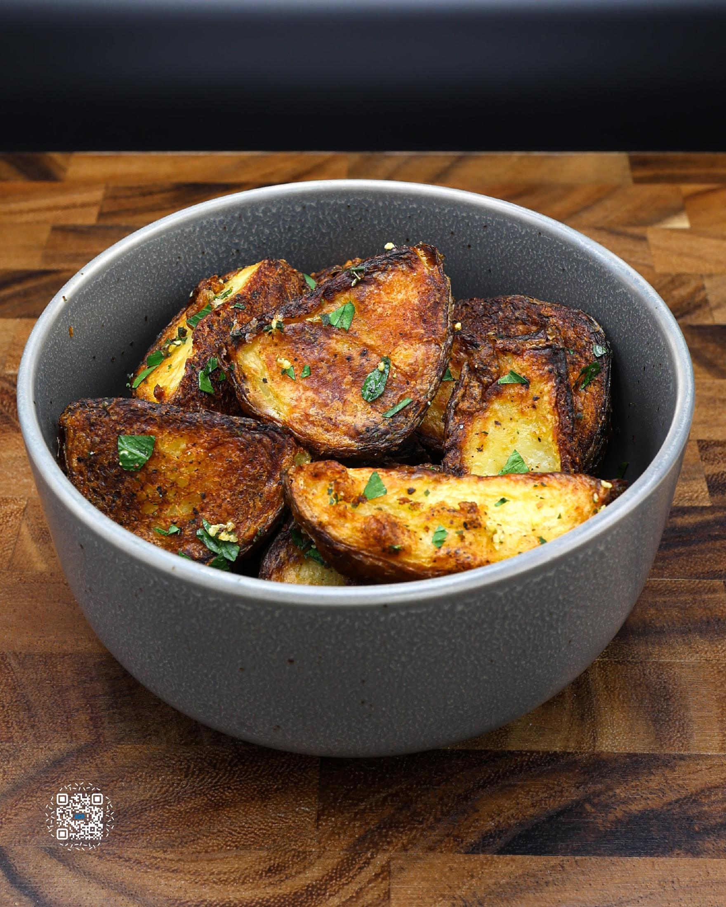
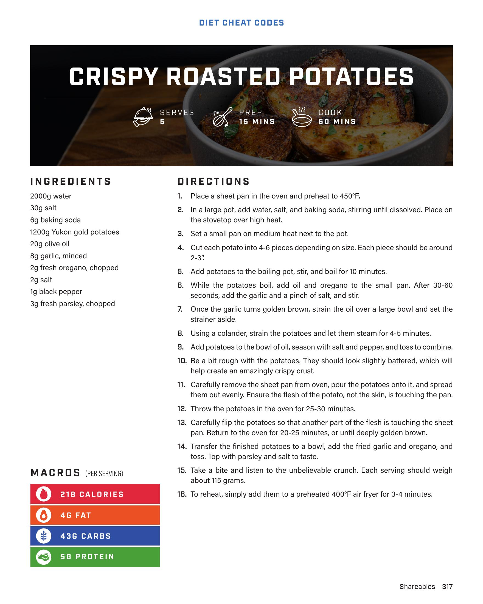

# CRISPY ROASTED POTATOES

**Serves:** 5 | **Prep:** 15 MINS | **Cook:** 60 MINS

## Macros

| Calories | Fat | Carbs | Net Carbs | Protein |
|----------|-----|-------|-----------|---------|
| 218 | 4 | 43 | undefined | 5 |

## Ingredients

- 2000g water
- 30g salt
- 6g baking soda
- 1200g Yukon gold potatoes
- 20g olive oil
- 8g garlic, minced
- 2g fresh oregano, chopped
- 2g salt
- 1g black pepper
- 3g fresh parsley, chopped

## Directions

1. Place a sheet pan in the oven and preheat to 450°F.
2. In a large pot, add water, salt, and baking soda, stirring until dissolved. Place on the stovetop over high heat.
3. Set a small pan on medium heat next to the pot.
4. Cut each potato into 4-6 pieces depending on size. Each piece should be around 2-3".
5. Add potatoes to the boiling pot, stir, and boil for 10 minutes.
6. While the potatoes boil, add oil and oregano to the small pan. After 30-60 seconds, add the garlic and a pinch of salt, and stir.
7. Once the garlic turns golden brown, strain the oil over a large bowl and set the strainer aside.
8. Using a colander, strain the potatoes and let them steam for 4-5 minutes.
9. Add potatoes to the bowl of oil, season with salt and pepper, and toss to combine.
10. Be a bit rough with the potatoes. They should look slightly battered, which will help create an amazingly crispy crust.
11. Carefully remove the sheet pan from oven, pour the potatoes onto it, and spread them out evenly. Ensure the flesh of the potato, not the skin, is touching the pan.
12. Throw the potatoes in the oven for 25-30 minutes.
13. Carefully flip the potatoes so that another part of the flesh is touching the sheet pan. Return to the oven for 20-25 minutes, or until deeply golden brown.
14. Transfer the finished potatoes to a bowl, add the fried garlic and oregano, and toss. Top with parsley and salt to taste.
15. Take a bite and listen to the unbelievable crunch. Each serving should weigh about 115 grams.
16. To reheat, simply add them to a preheated 400°F air fryer for 3-4 minutes.

## Additional Recipe Pages

## Source Pages

317, 318
