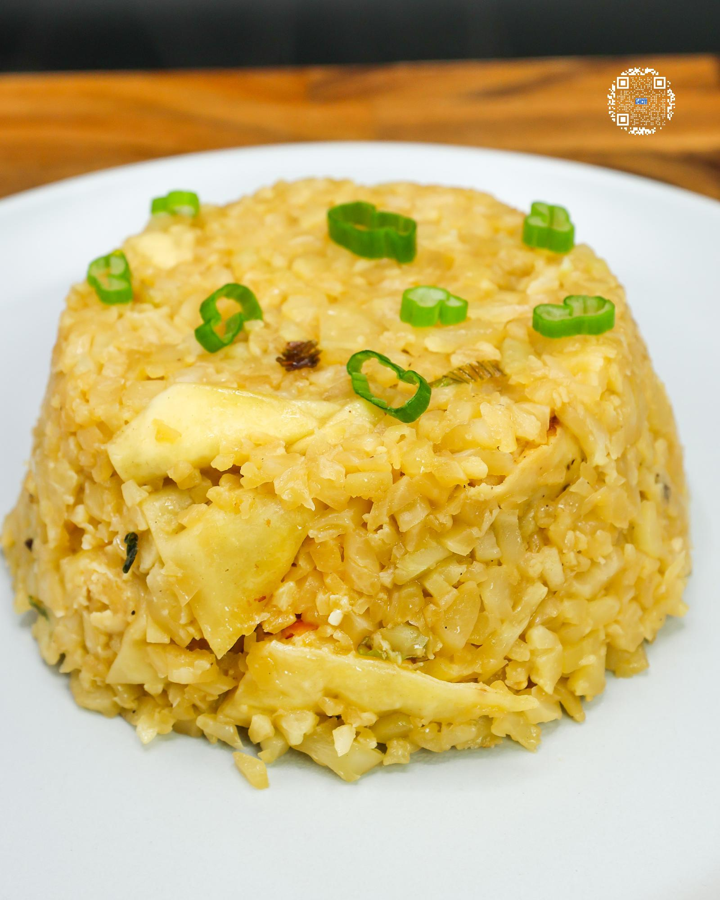

# DUMPLING FRIED RICE

**Serves:** 1 | **Prep:** 10 MINS | **Cook:** 5 MINS

## Macros

| Calories | Fat | Carbs | Net Carbs | Protein |
|----------|-----|-------|-----------|---------|
| 311 | 13 | 38 | N/A | 18 |

## Ingredients

- 3 dumplings, frozen (125 cal)
- 10oz bag cauliflower rice, frozen

### BOWL 1 (mixed)

- 15g oyster sauce
- 25g soy sauce
- 2g MSG
- Dash black pepper

### BOWL 2

- 9g avocado oil

### BOWL 3

- 7g green onion, chopped

### BOWL 4

- 8g garlic, minced

## Directions

1. Put dumplings in a bowl with 5g of water, cover 95% of the bowl with a lid or plastic wrap, and cook in microwave according to the instructions on the box, and chop dumplings into bite sized pieces.
2. Cook cauliflower rice in the microwave for the time recommended on the bag or rice your own cauliflower and cook. While cooking, prep all other ingredients by adding them into separate bowls.
3. Add avocado oil in preheated high-sided pan on medium heat.
4. Add green onions, stir to combine, and fry for 30 seconds.
5. Add the dumplings and stir to combine.
6. After 60 seconds, crush in garlic and stir to avoid burning.
7. Once garlic becomes fragrant, add cauliflower rice and Bowl 1, and stir to combine.
8. Let all flavors come together for 1-2 minutes while constantly stirring. Serve and eat.

