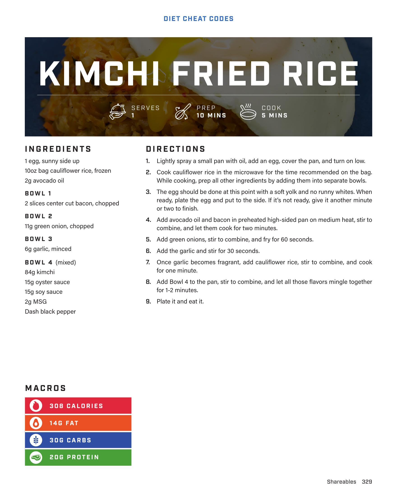

# KIMCHI FRIED RICE

**Serves:** 1 | **Prep:** 10 MINS | **Cook:** 5 MINS

## Macros

| Calories | Fat | Carbs | Net Carbs | Protein |
|----------|-----|-------|-----------|---------|
| 308 | 14 | 30 | N/A | 20 |

## Ingredients

- 1 egg, sunny side up
- 10oz bag cauliflower rice, frozen

### BOWL 1

- 2g avocado oil

### BOWL 2

- 2 slices center cut bacon, chopped

### BOWL 3

- 11g green onion, chopped

### BOWL 4 (mixed)

- 6g garlic, minced
- 84g kimchi
- 15g oyster sauce
- 15g soy sauce
- 2g MSG
- Dash black pepper

## Directions

1. Lightly spray a small pan with oil, add an egg, cover the pan, and turn on low.
2. Cook cauliflower rice in the microwave for the time recommended on the bag. While cooking, prep all other ingredients by adding them into separate bowls.
3. The egg should be done at this point with a soft yolk and no runny whites. When ready, plate the egg and put to the side. If it's not ready, give it another minute or two to finish.
4. Add avocado oil and bacon in preheated high-sided pan on medium heat, stir to combine, and let them cook for two minutes.
5. Add green onions, stir to combine, and fry for 60 seconds.
6. Add the garlic and stir for 30 seconds.
7. Once garlic becomes fragrant, add cauliflower rice, stir to combine, and cook for one minute.
8. Add Bowl 4 to the pan, stir to combine, and let all those flavors mingle together for 1-2 minutes.
9. Plate it and eat it.

## Additional Recipe Pages

## Source Pages

329, 330
