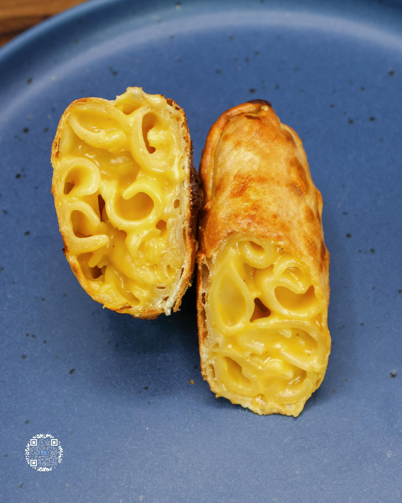

# MAC AND CHEESE EGG ROLLS

**Serves:** 4 | **Prep:** 1.5 HRS | **Cook:** 30 MINS

## Macros

| Calories | Fat | Carbs | Net Carbs | Protein |
|----------|-----|-------|-----------|---------|
| 271 | 3 | 42 | N/A | 21 |

## Ingredients

- 126g Banza® Noodles
- 4g salt
- Dash onion powder
- Dash black pepper

### CHEESE MIX

- 4 slices fat-free American cheese
- 2 slices sharp cheddar Velveeta®
- 56g fat-free cheddar cheese
- 60g fat-free milk
- 4g garlic, minced

### EGG ROLL BUILD

- 4 egg roll wraps (80 cal per wrap)
- 1 egg white
- Oil spray (4 seconds total)

## Directions

1. Add noodles and salt to boiling water and cook per label instructions, stirring occasionally so noodles do not stick to the bottom of the pot.
2. Drain noodles and save some of the pasta water for later.
3. Add noodles back to pot, put pot back on stovetop, and set burner to low.
4. Add all Cheese Mix ingredients and stir to combine. If necessary, add a spoonful or two of pasta water to successfully melt everything together. The goal is to have a thick mac and cheese so that the egg rolls fry up perfectly in the air fryer without leaking.
5. Separate egg white from the egg yolk into a small bowl and whisk until smooth.
6. Put 4 egg roll wraps on counter and using a brush, spread egg white on outer edges of the wrap. Add mac and cheese as evenly as possible across the center of each wrap.
7. Take the corner of the egg roll and wrap it over the mac and cheese. Try and tuck the triangle portion of the wrap into/under the mac and cheese.
8. Add more egg white to the corners of the wrap and fold in.
9. Add a little more egg white to the tip of the wrap and finish rolling. Make sure egg roll is fully sealed and repeat.
10. Place egg rolls on lightly oiled parchment paper and freeze for one hour. You can cook these right away, but I have found it to be better after freezing.
11. Add egg white to the entire outside of egg rolls, then add to a preheated 400°F air fryer fold side down and spray the top with oil for one second per egg roll.
12. After 3 minutes, flip egg rolls and spray each one with oil for an additional second.
13. Cook for an additional 3-4 minutes, get some low-calorie ranch and ENJOY.

## Tips

Make double the egg rolls, pull them from the freezer, and air fry whenever you need a quick snack or meal. Use these as an appetizer or as a side to another low-calorie entrée.

