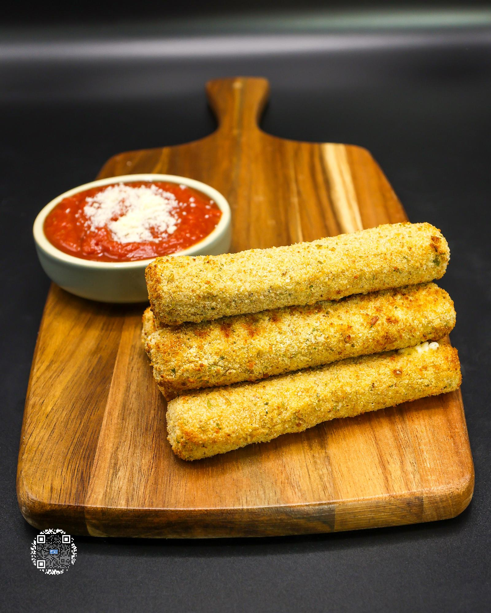

# MOZZARELLA STICKS

**Serves:** 1 | **Prep:** 25 MINS | **Cook:** 5 MINS

## Macros

| Calories | Fat | Carbs | Net Carbs | Protein |
|----------|-----|-------|-----------|---------|
| 498 | 23 | 29 | N/A | 42 |

## Ingredients

- 6 mozzarella sticks (45 Cal)

### DREDGE STATION 1

- 30g all-purpose flour

### DREDGE STATION 2

- 1 egg
- 1 egg white

### DREDGE STATION 3

- 100g plain breadcrumbs
- 10g grated Parmigiano-Reggiano cheese
- 1g dried parsley
- 5g salt
- 4g garlic powder
- Dash black pepper

## Directions

1. Set up dredging stations by adding all Dredge Station Ingredients to three separate containers and mixing until well combined.
2. Add 2 mozzarella sticks to Dredge Station 1, roll around until completely covered, and shake any excess flour off.
3. Add floured sticks to Dredge Station 2 and make sure they are completely covered in egg.
4. Lay mozzarella down in Dredge Station 3 and shake the container side to side to completely cover the sticks.
5. Press breading into the sticks for the most coverage and put back into Dredge Station 2.
6. Completely soak sticks and move back to Dredge Station 3 for one final breading.
7. Place breaded mozzarella sticks off to the side and repeat process until all 6 are done.
8. Add sticks to a preheated 400°F air fryer, make sure they aren't touching, and lightly spray with olive oil on both the top and bottom.
9. Cook for 2 minutes, flip sticks, and cook for another 2 minutes.
10. Plate em', grab some MARINARA SAUCE, and enjoy.

## Tips

Keep a close eye on the mozzarella sticks as they will start leaking if cooked for too long. Put breaded mozzarella sticks in the freezer for one hour or more to allow the mozzarella sticks to achieve a better browning and crisp in the air fryer.

