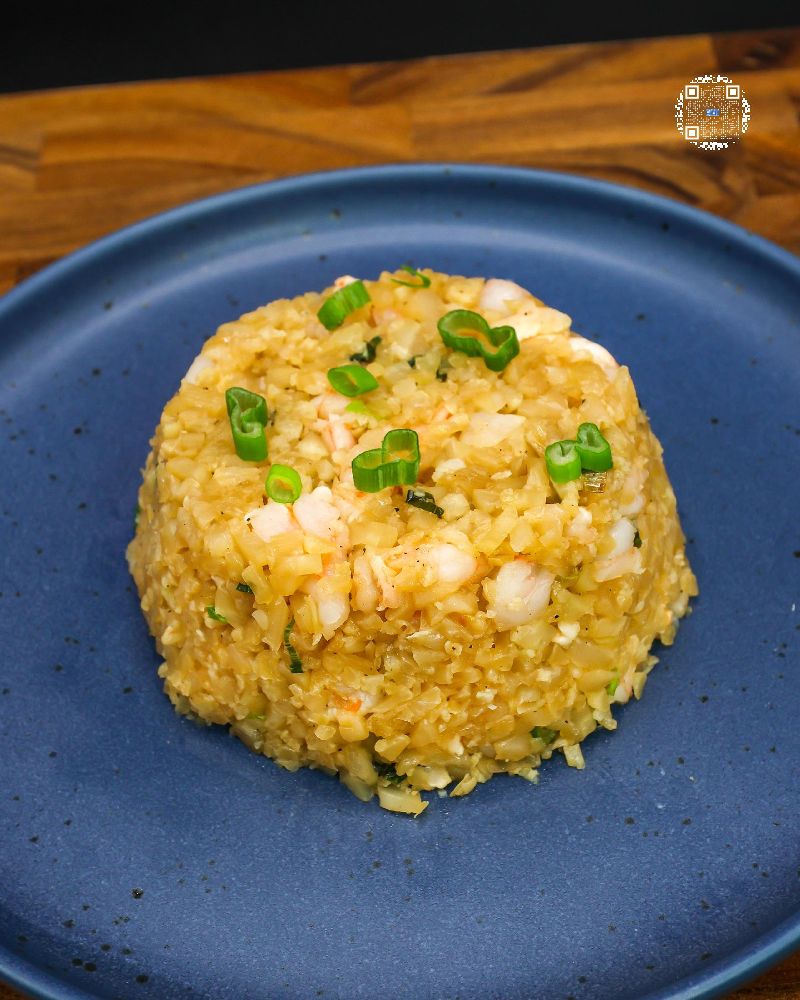
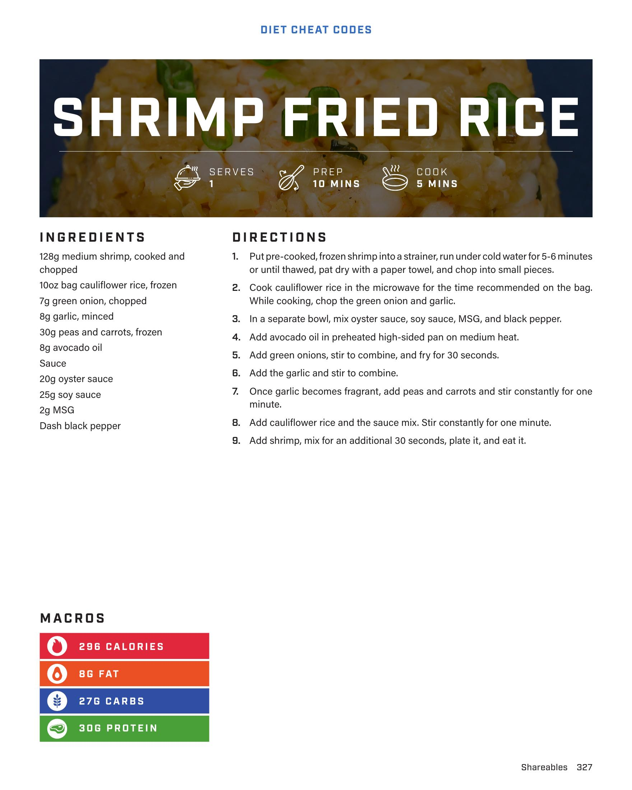

# SHRIMP FRIED RICE

**Serves:** 1 | **Prep:** 10 MINS | **Cook:** 5 MINS

## Macros

| Calories | Fat | Carbs | Net Carbs | Protein |
|----------|-----|-------|-----------|---------|
| 296 | 8 | 27 | N/A | 30 |

## Ingredients

- 128g medium shrimp, cooked and chopped
- 10oz bag cauliflower rice, frozen
- 7g green onion, chopped
- 8g garlic, minced
- 30g peas and carrots, frozen
- 8g avocado oil
- Sauce
- 20g oyster sauce
- 20g soy sauce
- 2g MSG
- Dash black pepper

## Directions

1. Put pre-cooked, frozen shrimp into a strainer, run under cold water for 5-6 minutes or until thawed, pat dry with a paper towel, and chop into small pieces.
2. Cook cauliflower rice in the microwave for the time recommended on the bag. While cooking, chop the green onion and garlic.
3. In a separate bowl, mix oyster sauce, soy sauce, MSG, and black pepper.
4. Add avocado oil in preheated high-sided pan on medium heat.
5. Add green onions, stir to combine, and fry for 30 seconds.
6. Add the garlic and stir to combine.
7. Once garlic becomes fragrant, add peas and carrots and stir constantly for one minute.
8. Add cauliflower rice and the sauce mix. Stir constantly for one minute.
9. Add shrimp, mix for an additional 30 seconds, plate it, and eat it.

## Additional Recipe Pages

## Source Pages

327, 328
