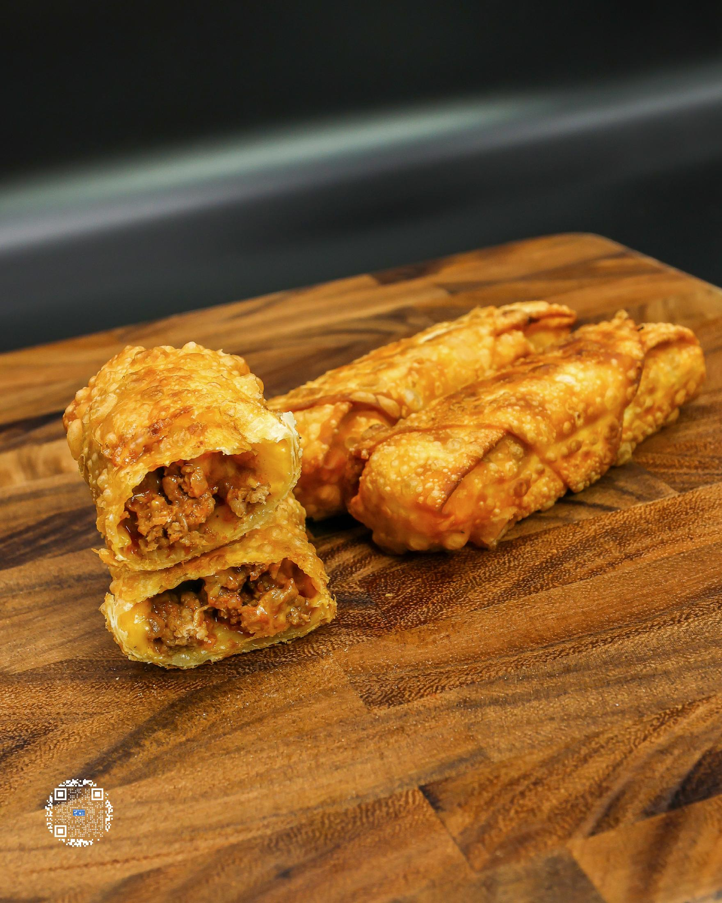
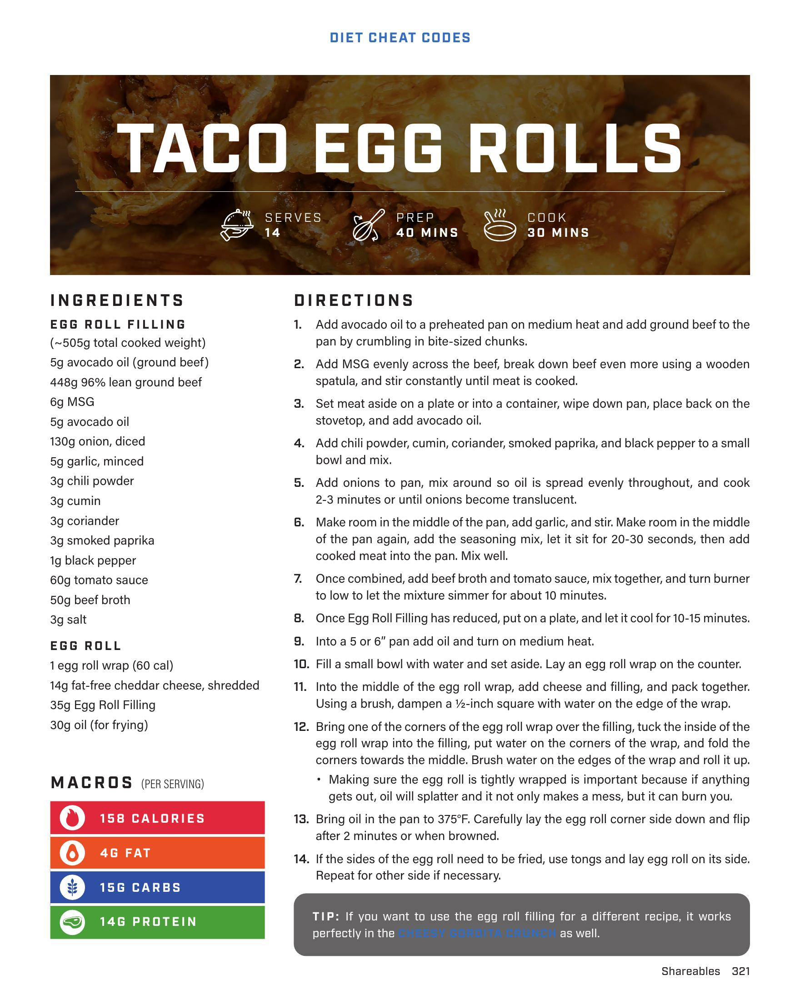

# TACO EGG ROLLS

**Serves:** 14 | **Prep:** 40 MINS | **Cook:** 30 MINS

## Macros

| Calories | Fat | Carbs | Net Carbs | Protein |
|----------|-----|-------|-----------|---------|
| 158 | 4 | 15 | undefined | 14 |

## Ingredients

### EGG ROLL FILLING (~505g total cooked weight)

- 5g avocado oil (ground beef)
- 448g 96% lean ground beef
- 6g MSG
- 5g avocado oil
- 130g onion, diced
- 5g garlic, minced
- 3g chili powder
- 3g cumin
- 3g coriander
- 3g smoked paprika
- 1g black pepper
- 60g tomato sauce
- 50g beef broth
- 3g salt

### EGG ROLL

- 1 egg roll wrap (60 cal)
- 14g fat-free cheddar cheese, shredded
- 35g Egg Roll Filling
- 30g oil (for frying)

## Directions

1. Add avocado oil to a preheated pan on medium heat and add ground beef to the pan by crumbling in bite-sized chunks.
2. Add MSG evenly across the beef, break down beef even more using a wooden spatula, and stir constantly until meat is cooked.
3. Set meat aside on a plate or into a container, wipe down pan, place back on the stovetop, and add avocado oil.
4. Add chili powder, cumin, coriander, smoked paprika, and black pepper to a small bowl and mix.
5. Add onions to pan, mix around so oil is spread evenly throughout, and cook 1-2 minutes or until onions become translucent.
6. Make room in the middle of the pan, add garlic, and stir. Make room in the middle of the pan again, add the seasoning mix, let it sit for 20-30 seconds, then add cooked meat into the pan. Mix well.
7. Once combined, add beef broth and tomato sauce, mix together, and turn burner to low to let the mixture simmer for about 10 minutes.
8. Once Egg Roll Filling has reduced, put on a plate, and let it cool for 10-15 minutes.
9. Into a 5" or 6" pan add oil and turn on medium heat.
10. Fill a small bowl with water and set aside. Lay an egg roll wrap on the counter.
11. Into the middle of the egg roll wrap, add cheese and filling, and pack together. Using a brush, dampen a ½-inch square with water on the edge of the wrap.
12. Bring one of the corners of the egg roll wrap over the filling, tuck the inside of the egg roll wrap into the filling, put water on the corners of the wrap, and fold the corners towards the middle. Brush water on the edges of the wrap and roll it up. Making sure the egg roll is tightly wrapped is important because if anything gets out, oil will splatter and it not only makes a mess, but it can burn you.
13. Bring oil in the pan to 375°F. Carefully lay the egg roll corner side down and flip after 2 minutes or when browned.
14. If the sides of the egg roll need to be fried, use tongs and lay egg roll on its side. Repeat for other side if necessary.

## Tips

If you want to use the egg roll filling for a different recipe, it works perfectly in the as well.

## Additional Recipe Pages

## Source Pages

321, 322
