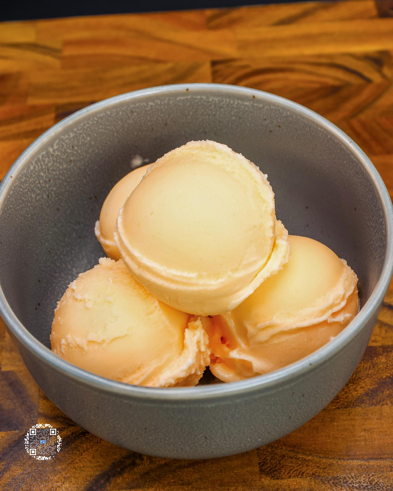

# CANTALOUPE SORBET

**Serves:** 1 | **Prep:** 15 MINS | **Cook:** 5 MINS

## Macros

| Calories | Fat | Carbs | Net Carbs | Protein |
|----------|-----|-------|-----------|---------|
| 102 | 0 | 44 | 24 | 3 |

## Ingredients

- 1 cantaloupe

### PINT INGREDIENTS

- 300g cantaloupe
- 160g water
- 20g granulated erythritol
- 0.5g salt

## Directions

1. Wash and dry the outside of the cantaloupe, cut the ends off the cantaloupe, trying to make sure to cut off as little of the orange part as possible, then cut in half.
2. Remove the seeds, put half of the cantaloupe off to the side, and place the other half cut side down on the cutting board.
3. Cut where the orange meets the green (the rind) and try to follow that all the way down.
4. Go around the entire cantaloupe until there is no more rind remaining, but if a little rind remains, that is okay. Cube the orange flesh of the cantaloupe and set aside.
5. Repeat steps 3-6 for the other half of the cantaloupe.
6. Load the blender up with the chunks of cantaloupe, blend for 30 seconds or until pureed, put into storage containers, and repeat with any remaining cantaloupe.
7. Directly into a pint add Pint Ingredients and using a handheld blender, mix for 30 seconds.
8. Put the top on the pint and freeze for 24 hours.
9. Take the pint out of the freezer, run it under warm water for 60 seconds, dry the pint off, and load it into the CREAMi®.
10. Run pint on the sorbet function and directly after on the re-spin function.
11. Unload the pint and using a spoon push the contents of the CREAMi® down, smooth and level the surface, load it back up, and hit the re-spin button.
12. A perfect sorbet consistency has now been achieved and it is time to eat.

