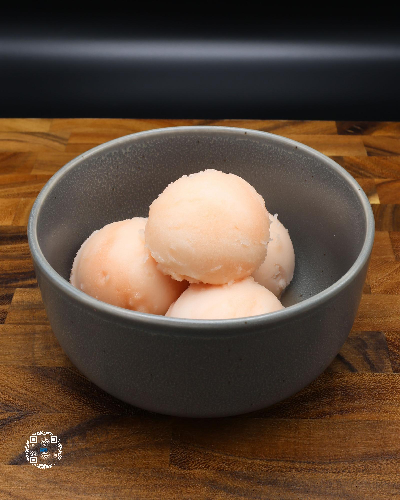

# GRAPEFRUIT SORBET

**Serves:** 1 | **Prep:** 10 MINS | **Cook:** 5 MINS

## Macros

| Calories | Fat | Carbs | Net Carbs | Protein |
|----------|-----|-------|-----------|---------|
| 73 | 0 | 69 | 19 | 2 |

## Ingredients

- 220g grapefruit
- 220g water
- 50g granulated erythritol
- .5g salt
- .5g xanthan gum
- Zest of half grapefruit

## Directions

1. Zest half of a grapefruit into a high sided container.
2. Juice grapefruit into a medium sized bowl.
3. Strain juice into the container as well as adding any extra pulp. Add water.
4. Into a small bowl, add erythritol, salt, and xanthan gum. Whisk together.
5. Using an immersion blender, start mixing the wet ingredients while slowly adding in the dry ingredients.
6. Once all dry ingredients have dissolved, continue blending for 90 seconds.
7. Add to a pint, put the top on, and freeze for 24 hours.
8. Take the pint out of the freezer, run it under warm water for 60 seconds, dry the pint off, and load it into the CREAMi®.
9. Run pint on the sorbet function and re-spin the pint 1-2 more times for desired consistency.
10. Eat.

