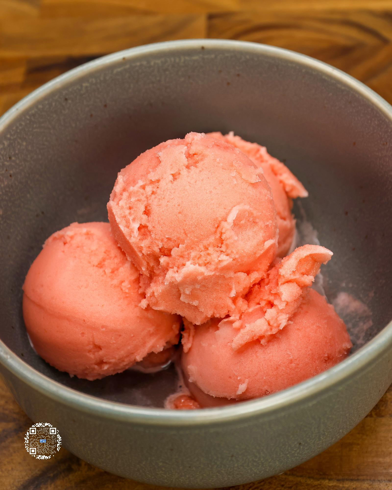

# WATERMELON SORBET

**Serves:** 1 | **Prep:** 15 MINS | **Cook:** 5 MINS

## Macros

| Calories | Fat | Carbs | Net Carbs | Protein |
|----------|-----|-------|-----------|---------|
| 99 | 0 | 46 | 26 | 3 |

## Ingredients

- 1 seedless watermelon

### PINT INGREDIENTS

- 330g seedless watermelon
- 110g water
- 20g granulated erythritol
- 0.5g salt

## Directions

1. Wash and dry the outside of the watermelon and put it on the biggest cutting board you have.
2. Cut the ends off the watermelon, trying to make sure to cut off as little of the pink part as possible, then cut the watermelon in half.
3. Put half of the watermelon off to the side and the other half cut side down on the cutting board.
4. Cut where the pink meets the white (the rind) and try to follow that all the way down.
5. Go around the entire watermelon until there is no more rind remaining, but if a little rind remains, that is okay.
6. Cube the red flesh of the watermelon and set aside.
7. Repeat steps 3-6 for the other half of the watermelon.
8. Load blender up, blend for 30 seconds or until watermelon is broken down, put into storage containers, and repeat until the entire watermelon has been pureed.
9. Directly into a pint add Pint Ingredients and using a handheld blender, mix for 30 seconds.
10. Put the top on the pint and freeze for 24 hours.
11. Take the pint out of the freezer, run it under warm water for 60 seconds, dry the pint off, and load it into the CREAMi®.
12. Run pint on the sorbet function and directly after on the re-spin function.
13. Unload the pint and using a spoon, push the contents of the CREAMi® down, smooth and level the surface, load it back up, and hit the re-spin button.
14. A perfect sorbet consistency has now been achieved and it is time to eat.

## Tips

Instead of blending every gram of watermelon, put some chunks in containers to have as a quick snack or great pre-workout meal.You can buy pre-cut fruit to make the first part of this process go much faster, but it will also be much more expensive to do so. In addition, after you cut and puree the watermelon you will have enough for 10+ sorbets, so it's worth putting the extra work in.

